# Introduction

[QGC-Gov](https://qgcgov.com/) is an open-source UAS Ground Control Station for controlling vehicles trusted by the US Department of Defense and the US Federal government.
More specifically, it can be used to control any multicopter, fixed-wing or hybrid sUAS that is compatible with the RAS-A protocol.

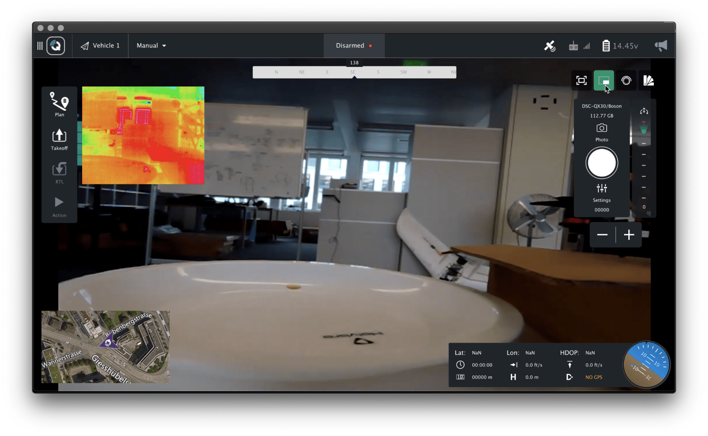 <!-- TODO: New image -->

It is designed with a focus on ease of use and safety.
Navigation is straightforward, with a very clear division between planning missions, flying, and configuration.
Views are clean and uncluttered, displaying just the telemetry, mission and flight path information that is needed for safe flight.
There are both audible and visual notifications for important warnings, and readily accessible logs for less important status updates.
QGC-Gov even provides a pre-flight checklist to help you ensure your vehicle and mission are safe to fly before you even take off.

QGC-Gov enables the planning and automated execution of complex pre-planned ground, structure and corridor survey missions using simple graphical tools.
Images can be captured automatically using any of the many supported visible-light and IR cameras, and at any time you can view the video feed, flight path and telemetry.
If you need to you can pause and restart the mission, jump forward or back, or even change it altogether.

Manual control can be implemented using physical controls, on-screen controls, or a combination of both.
The ground station enhances purely manual flight-control by providing high level commands like "takeoff", "go to location", "fly to a safe place and land", and so on.

Up to 255 vehicles can be controlled at a time (although only very experienced pilots should attempt to control more than one).

## Compatibility

### Flight Stacks

*QGC-Gov* can be used with flight stacks that support the RAS-A protocol.

### OS Compatibility

Compatible with: Android 10, Android 11, Ubuntu 20.04

### Hardware

*QGC-Gov* can run on any relatively recent PC or tablet hardware that supports the indicated OS.

Hardware with integrated physical joysticks/buttons can make manual control of the vehicle and camera a lot easier.
Recommended controls include:

- Analog sticks for throttle/yaw and roll/pitch
- Camera zoom in/out buttons
- Image/video capture button
- Gimbal up, down, yaw left/right buttons

# Important Reminders

The following reminders are provided to help ensure you have a safe flight:

1. Ensure both your vehicle and planned flight are safe before you take off.
   The inbuilt pre-flight checklist can guide you through the steps.
2. Be aware of local regulations with respect flying drones in your planned location.
3. Turn up the sound on your ground station loud enough to hear warnings.

<!--  TODO:  Decide if we need stick settings/mode to be pulled out as part of hardware near front, or assume they remain in the settings.
The RC stick control mode (mode 0, mode 1, mode 2 etc.) and the mapping of buttons to actions can be configured in the **Vehicle Settings > [Joystick Setup](#joystick-setup)** view.
-->

<!-- 
*Tactical Open Government Owned Architecture* (TOGA)
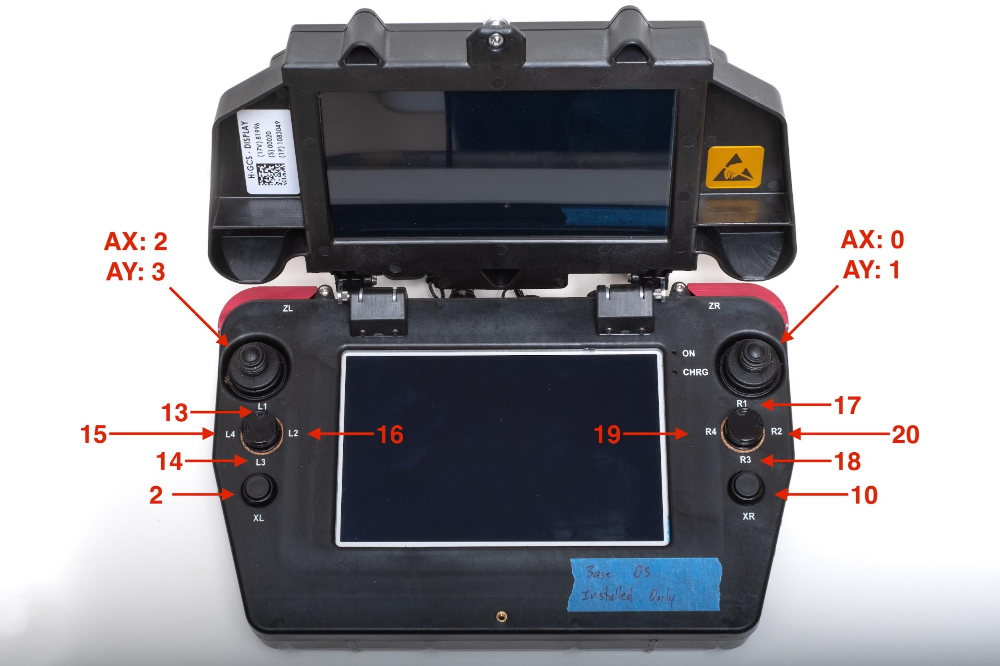

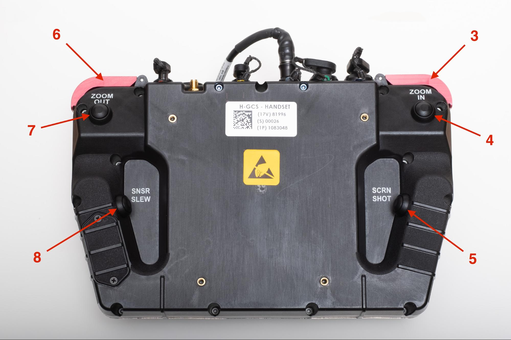
-->

# Connection Management

QGC-Gov can be used to securely _pair_ and _connect_ ground and air communication modules so they are able to connect and exchange data.

Connections are managed using the _Manage Connections_ dialog, which is displayed when you select the _Connections_ icon in the top toolbar.

Multiple vehicles can be paired to the ground station and users can then choose which vehicle(s) to connect.
It is possible to pair multiple vehicles using a single GCS radio or have multiple connection methods. 

> **Note:** QGC-Gov can theoretically connect to up to 254 vehicles at a time (this is maximum supported by RAS-A), but working with larger number and more complex radio configurations is untested.
> However the actual number depends on the communication modules used, and is practically limited by how many vehicles a pilot can safely control.

## Enable Connection Management

The _Connection Manager_ is enabled from the [general miscellaneous application settings](#miscellaneous).

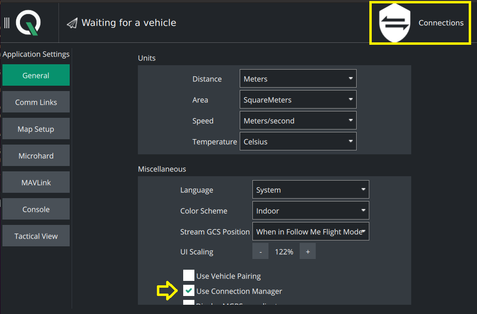

Select the checkbox: **Use Connection Manager**.
The connection manager icon will then appear in the top toolbar as shown.

## Setup Ground Radio

The first step is to setup the radio attached to your ground station:

1. Select the **Connections** icon to open the _Manage Connections_ dialog.
   This will initially be empty as you haven't set up any connections.
   
   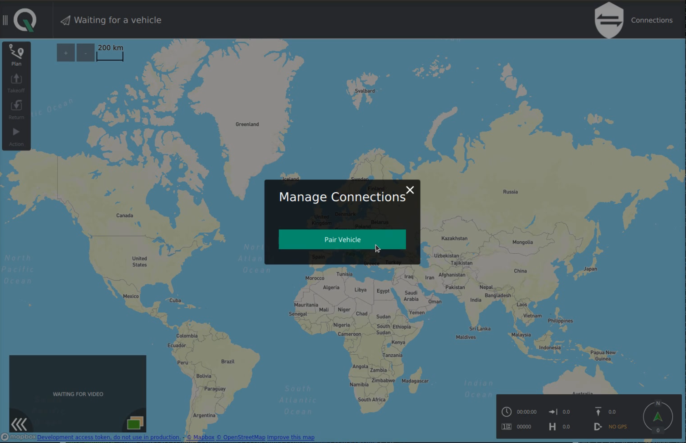
   
   Select **Pair Vehicle** to start setting up the ground radio
   
1. The _Pair Vehicle_ prompt will appear.
   Press the pairing button on your vehicle 3 times (this button is usually configured as a switch on the GPS unit). 

   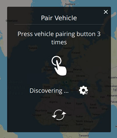

   The _Setup Ground Radio_ dialog appears when a radio is detected.
   
   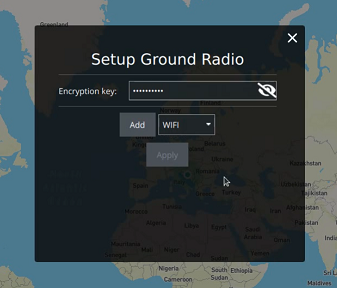

1. Use the drop-down list to select a new type of connection to add (in this case it will be Microhard).

   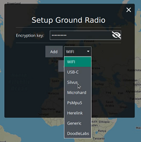
   
   Then select **Add** to add the connection.

   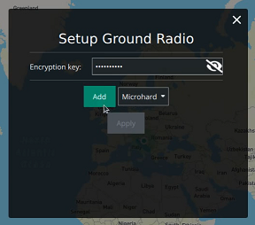

1. After a short wait the dialog will then populate with password and network information as shown below.
   
   This should be preconfigured correctly for your radio/network.

   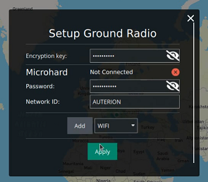
   
   > **Note:** The _Encryption key_ and _Password_ have to match the configuration on the vehicle.
   > Default values are provided; these must be updated if the vehicle is reconfigured.

1. Press **Apply** to save the settings.

   After a short while the settings will be applied and the _ground radio_ will be shown as connected.

   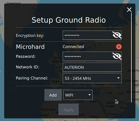

1. Press **X** to exit the dialog and start discovering/pairing the vehicle.

### Pairing to a Vehicle

After indicating that you want to pair to a vehicle the _Pair vehicle dialog_ will appear:

1. When the pair vehicle dialog appears:

   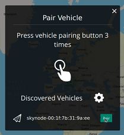
   
   - Select the **Pair** button on the dialog next to the discovered vehicle that you wish to connect to.
   - Press the pairing button on the vehicle 3 times.

1. The vehicle will then attempt to pair.

   On success the **Manage Connections** dialog is displayed indicating the connected vehicle and channel.
   
   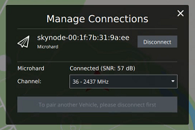
   
If the pairing doesn't succeed the wheel on the pairing dialog spins and the subtitle changes to "Retrying with pairing". Retrying can be ended only by clicking "Cancel".

### Connecting to a Vehicle

After a vehicle has been paired it will be always be displayed on the **Manage Connections** dialog, allowing easy reconnection:

1. Click the _Connections_ icon in the toolbar to launch the **Manage Connections** dialog.

1. Select the **Connect** button next to a vehicle to connect it:

   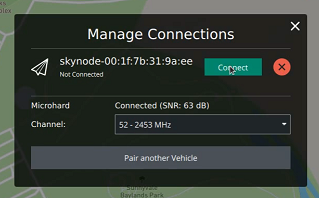
   
   The vehicle will then attempt to connect.
   On success it will be shown as connected:

   

If the ground station is unable to connect to a vehicle the state will stay as "Connecting" until the dialog is canceled.

### Disconnecting a Vehicle

A connected vehicle is disconnected using the **Manage Connections** dialog:

1. Click the _Connections_ icon in the toolbar to launch the **Manage Connections** dialog.

   
   
1. Select the **Disconnect** button to disconnect an active connection.

   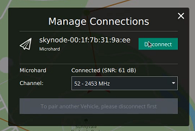

   You will then be prompted to confirm:
   
   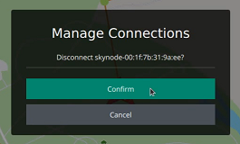

### Changing the Connection Channel

You can change the connection channel using the **Manage Connections** dialog:

1. Click the **Connections** icon in the toolbar to launch the _Manage Connections_ dialog.

   

1. Select the _Channel_ drop down and then choose the channel to use:

   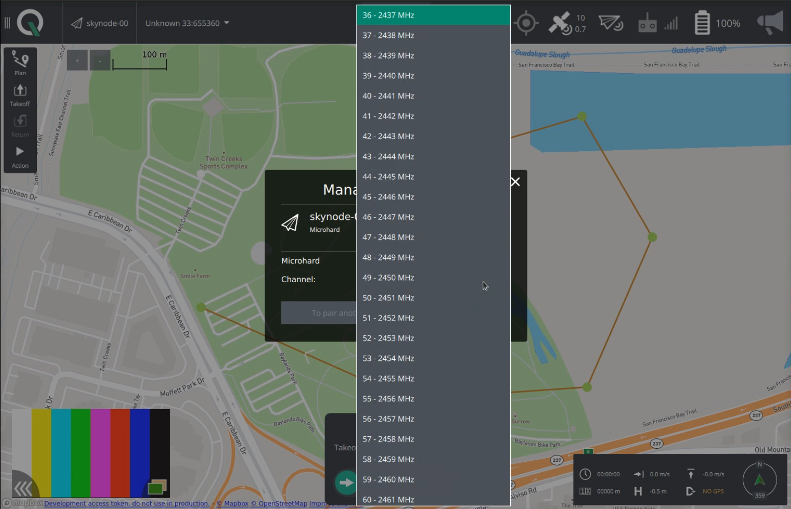

   The connection manager will immediately try and reconfigure both radios.
   
   
   
1. On success it will display a dialog indicating the connection is reconfigured.

   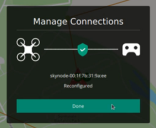.
   
   Press **Done** to return to the **Manage Connections** dialog.

   

# App Menu

The application menu is accessed from the **Q** icon on the top left of the application.
The menu slides in from the left.

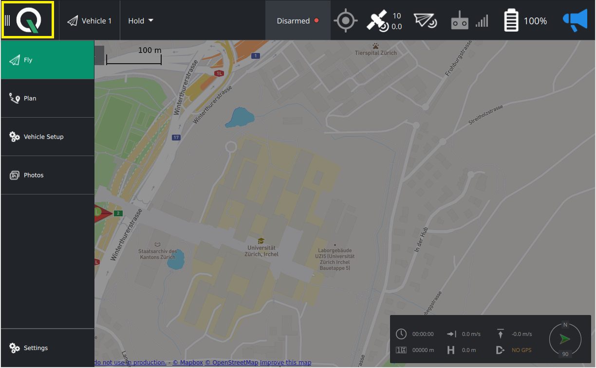 \

The menu provides access to separate views which are used for each main activity

[Fly](#fly-view) (default)
  ~ &nbsp;
  ~ Flying both manually and autonomously, using map or camera view.

[Plan](#plan-view)
  ~ &nbsp;
  ~ Planning missions, geofence, and rally points.
  
Tactical
  ~ &nbsp;
  ~ TBD <!-- also need to update sidebar image above -->
  
[Vehicle Setup](#vehicle-setup)
  ~ &nbsp;
  ~ Configure vehicle-specific settings (calibration, failsafes, etc.).

[Photos](#photos)
  ~ &nbsp;
  ~ Photo gallery for managing captured images and video.
  
[Settings](#application-settings)
  ~ &nbsp;
  ~ Configure application settings (e.g. display units, map providers, etc.).

> **Note:** You can toggle between [Fly](#fly-view) and [Plan](#plan-view) using a dedicated toolbar button in each view

# Fly View

*Fly View* is used for all operations related controlling a vehicle in flight.
You can fly with either map or video feed in the foreground, and monitor the status using the camera and/or telemetry information.

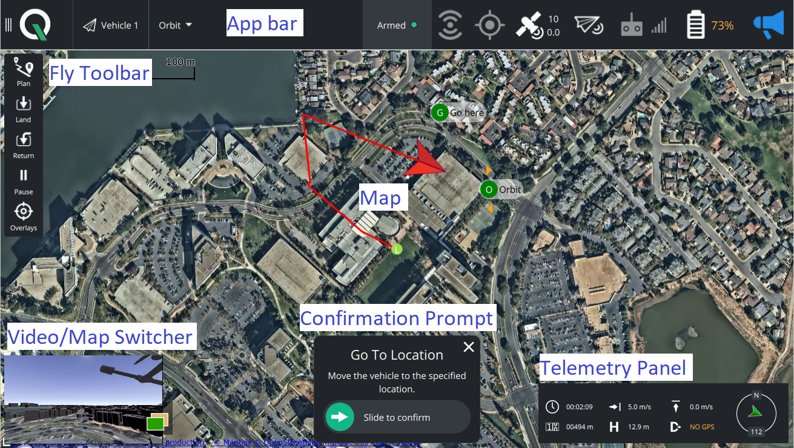 \

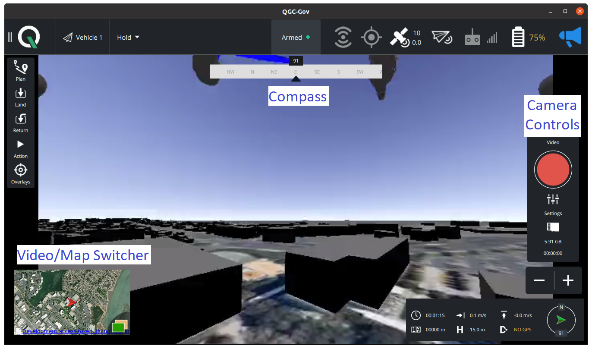 \

The main sections of the _Fly View_ are:

<!-- TBD - finish this list on main sections -->

[App Bar](#fly-view-app-bar)
  ~ &nbsp;
  ~ Vehicle selector and high-level status information (connection, mode, GPS, battery, log)
  
[Toolbar](#fly-toolbar)
  ~ &nbsp;
  ~ Select actions including checklist, takeoff, land, return, run mission.

[Map](#fly-view-map)
  ~ &nbsp;
  ~ Vehicle map, showing flight path, mission, and so on. Select actions like "orbit" and "goto"
  
[Telemetry Panel](#telemetry-panel)
  ~ &nbsp;
  ~ Vehicle flight and mission telemetry.
  
[Video/Map Switcher](#switcher)
  ~ &nbsp;
  ~ Switch between [Map](#fly-view-map) and [Camera View](#camera-view).
  
[Camera View](#camera-view)
  ~ &nbsp;
  ~ Fly with foreground camera view. Control image and video capture and settings.

## Fly View App Bar

 \

The _Fly View_ app bar is used to monitor high level vehicle state and modes, and to set the current vehicle, mode, and armed state.
The status icons can be selected for additional information.

<!-- TODO: Cross link this to sections --> 

[App menu](#app-menu)
  ~ &nbsp;
  ~ Select/change application views.
  
Vehicle
  ~ &nbsp;
  ~ Displays current vehicle under control.
  ~ Select to change current vehicle.
  
[Flight mode](#flight-mode-selector)
  ~ &nbsp;
  ~ Display current mode.
  ~ Select either [Position mode](#position-mode) or [Altitude mode](#altitude-mode).

Arm state
  ~ &nbsp;
  ~ Display _arm state_: Armed (motors spinning), Disarmed (motors stopped).
  ~ Select to arm/disarm on ground.
  ~ Select to _emergency stop_ in air.
  
[Connection management](#connection-management)
  ~ &nbsp;
  ~ Pair and connect vehicle and ground station.

[ROI](#region-of-interest)
  ~ &nbsp;
  ~ Display _Region of Interest_ state: enabled (green), no ROI (grey).
  ~ Select to remove the active ROI.

Telemetry Status
  ~ &nbsp;
  ~ Select to open prompt with detailed telemetry RSSI information.
  
RC Status
  ~ &nbsp;
  ~ Display RC controller signal status. The bars on the status icon indicate _uplink_ signal strength.
  ~ Select to open prompt with uplink and downlink RSSI.
  
GPS Status
  ~ &nbsp;
  ~ Display GPS satellite count and HDOP. 
  ~ Select to open prompt with additional information.
  
Battery Status
  ~ &nbsp;
  ~ Battery percentage remaining.
  ~ Select to open prompt with more detailed information.
  
[Log](#notification-log)
  ~ &nbsp;
  ~ Display log status: Warning (important unread messages), Blue announce (unread/non-critical messages), Grey announce (read messages)
  ~ Select to display notification log

### Flight Mode Selector

QGC-Gov displays the active [flight mode](#flight-modes) for the current vehicle in the flight mode selector on the [Fly View app bar](#fly-view-app-bar).

 \

The selector menu can be opened to _select_ either of the two **manual** modes: [Position mode](#position-mode) (recommended) and [Altitude mode](#altitude-mode).

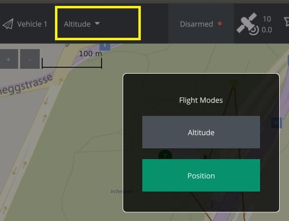 \

Other modes are selected from toolbar actions like takeoff, land, mission, and so on.

> **Note:** A vehicle will only switch to a manual mode if a manual control method is enabled: RC controller, Joystick or virtual joysticks.

<!-- Vehicle selector etc need to be added -->

### Notification Log

The notification log dialog is accessed from the "announcements" icon on the [Fly View app bar](#fly-view-app-bar).

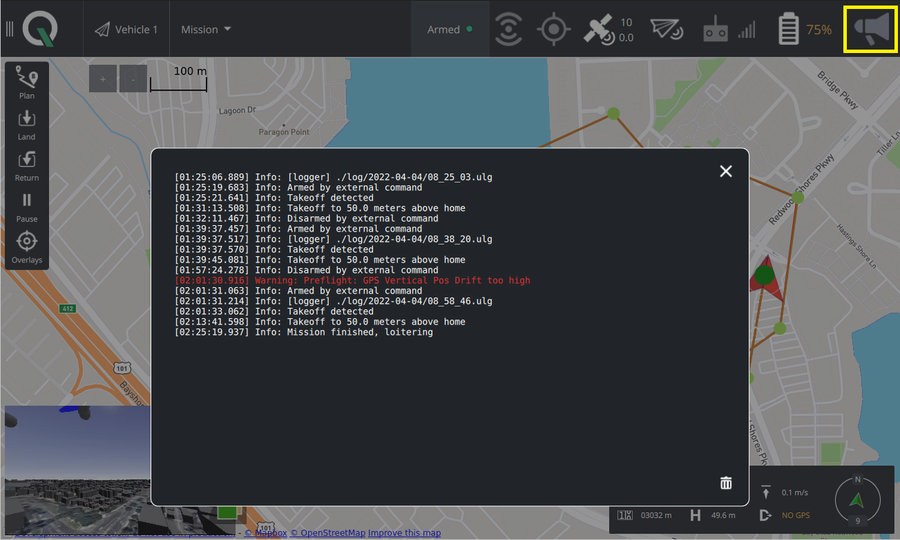 \  <!-- image87.png -->

The log uses different icons to indicate notification status.

Icon | Description
--- | ---------
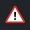 | Important unread notifications. These notifications are also "spoken" by the GCS.
 | Unread notifications.
 | No unread notifications.

The log can be closed using the **X** icon and emptied using the "trash" icon.

## Telemetry Panel

The telemetry panel provides vehicle telemetry and flight information, including: flight time and distance, speed, altitude, and heading.

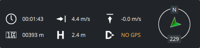 \ <!-- 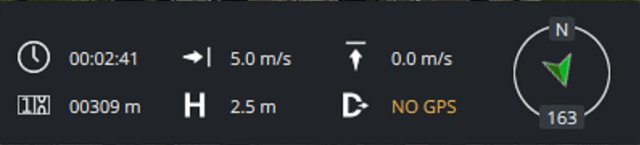 -->

Click anywhere in the control to toggle an expanded panel with additional information including: latitude, longitude, HDOP and artificial horizon instrumentation.

 \ <!-- 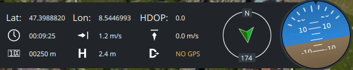 -->

The table below shows the purpose of each field.

Icon | Description
--- | --------- 
 | Time since armed (approximate flight time).
 | Horizontal speed.
 | Ascent/descent speed
 | Distance traveled (odometer).
 | Altitude above home.
 | Distance between vehicle and ground station. This requires GPS/position on the ground station!
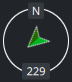 | Vehicle heading (direction of travel).
Lat | Vehicle latitude (Expanded panel).
Lon | Vehicle longitude (Expanded panel).
HDOP | GPS Horizontal Degree of Precision (Expanded panel).
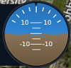 | Artificial horizon (Expanded panel)

## Fly View Map

The Fly View Map shows the current vehicle position, historical flight path (in red), and various markers such as a "goto" location, or the path of a mission (if one has been loaded).

You can click on the map to set a goto, orbit or region of interest target, and use the map switcher to change the type of map that is displayed.

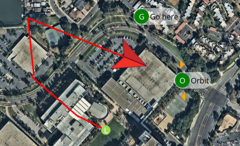 \ <!-- image150.png -->

### Map Types

The map selector on the Video/Map widget can be used to change the displayed map type.

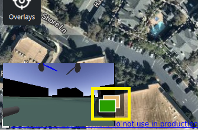

QGC-Gov supports: _street view_, _satellite view_, or _hybrid satellite/street view_.

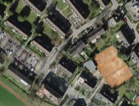

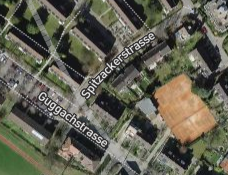

### Map Actions (Fly View)

Actions that require a position are initiated by selecting the location on the map (when flying).
A popup menu will be displayed allowing the desired operation to be selected.

 \

Map actions must be acknowledged using a [confirmation prompt](#confirmation-prompts).
You may also need to set some additional information like the orbit radius.
After acknowledging the prompt a [map marker](#map-markers) is added to the map and the action will be executed.

For more information see:

- [Goto Location](#goto-location) (Flying using High-Level Commands)
- [Orbit Location](#orbit-location) (Flying using High-Level Commands)
- [Region of Interest](#region-of-interest) (Flying Manually)

### Map Markers

Map markers indicate particular locations and targets, like the target of a [Go here](#goto-task):

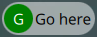
 
The map markers include:

Marker | Description
--- | -----
**(G)** Go here | The target of a [Go here](#goto-task) task.
**(O)** Orbit here | The center of a [Orbit here](#orbit-location) target.
**(R)** ROI here | The current [Region of interest (ROI)](#region-of-interest).
**(L)** | Land/Home marker.
 | Mission waypoint
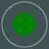 | Selected (target) mission waypoint

### Map Grid (MGRS)

The map in **Fly-** and **Plan View** may (optionally) overlay a grid and vehicle position information in MGRS coordinates.

> **Note:** Enable the overlay in the settings by selecting the checkbox:
> **Application Settings > General > Miscellaneous > Display MGRS coordinates**.

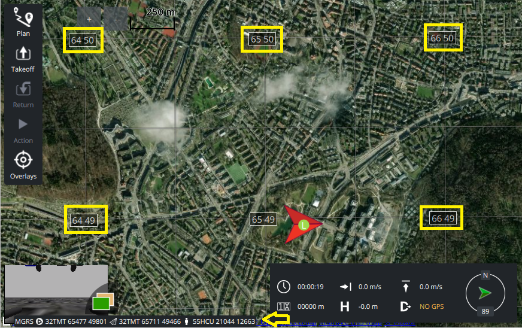  <!-- image112.jpg -->

The grid overlay shows map coordinates with 10m resolution \[4 digits\].

The information strip at the bottom is visible in **Fly View** only.
It provides the position of the *map center* (caret icon) and the *vehicle* (plane icon) to one meter accuracy \[5 digits\].

The strip will additionally include the *ground station location* ("person" icon) **if** the ground station has a GPS module.  

> **Note:** The MGRS coordinate system divides the world up into 100000m2 submaps, and then defines positions within each map in terms of northing and easting values.
> The resolution of the northing/easting values is determined by the number of digits provided: 5 digits gives 1m resolution, 4 digits gives 10m resolution, while 1 digit gives just 10km resolution.
>
> So for example, 32TMT 49 18 is a position in the 32TMT square with 1000 meter resolution, while 32TMT 49000 18000 is the same coordinate with 1m resolution.
>
> For more information see [MGRS coordinates](https://en.wikipedia.org/wiki/Military_Grid_Reference_System) (Wikipedia).

## Fly Toolbar

The _Fly View Toolbar_ is used to execute flight and preflight operations that do not require a specific map position.

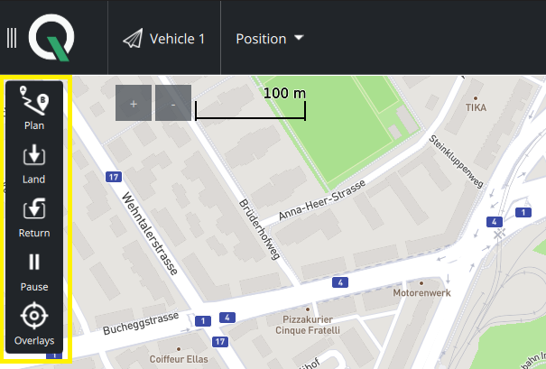 \

The toolbar only offers valid options for the current vehicle state (invalid options are either removed or greyed out).
Some toolbar options, such as the [Checklist](#preflight-checklist), must be enabled in settings.

All toolbar actions are listed below.

[Plan](#plan-view)
  ~ &nbsp;
  ~ Switch to _Plan View_ (in order to plan a mission, geofence or rally point).

[Checklist](#preflight-checklist)
  ~ &nbsp;
  ~ Start pre-flight safety checks.
  
[Takeoff](#takeoff-mode)
  ~ &nbsp;
  ~ Arm vehicle and takeoff (option visible if landed).
  
[Land](#land-mode)
  ~ &nbsp;
  ~ Land vehicle and disarm (option visible if flying).
  
[Return](#return-mode)
  ~ &nbsp;
  ~ Fly to a safe point (option enabled if flying). The path/landing behaviour depends on vehicle configuration.
  
[Pause](#hold-mode)
  ~ &nbsp;
  ~ Pause current operation or mission.
  
Action
  ~ &nbsp;
  ~ Display additional context-sensitive actions for the current vehicle state.
    May be used to change the altitude, pause, continue or edit a mission, takeoff if landed, etc.
  
[Edit](#pause-edit-continue-a-mission)
  ~ &nbsp;
  ~ Edit the current mission, after switching to [Plan View](#plan-view) (only visible when in a paused mission).
  
[Overlay]
  ~ &nbsp;
  ~ TBD <!-- TODO: What is this? -->

### Confirmation Prompts

All operations must be confirmed using a slider before they will be executed.
Confirmation prompts are displayed in the bottom center of the map (if an altitude can be set for an operation, a vertical slider will be displayed at the same time).

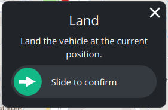 \

### Preflight Checklist

The *Preflight Checklist* is used to verify that a vehicle and planned flight path are safe to fly.
It is started from the **Checklist** button on the Fly View toolbar.

> **Note:** If the checklist button is not displayed when a vehicle is connected then this feature is disabled.
> You can enable it in the application settings: **Menu > Settings > General > Fly View >** _Use Preflight Checklist_ (checkbox)

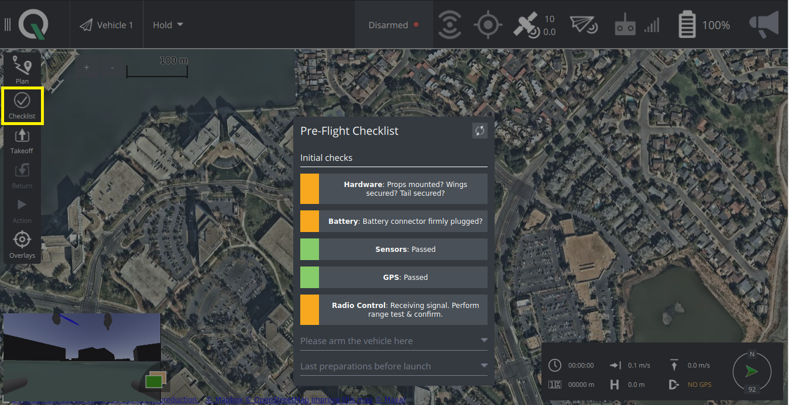 \ <!-- image103.png -->

The checklist has three separate sections, each containing a number of tests that have a color-coded status button and a description.
Tests are either automatic or manual; the automatic tests run without intervention while the manual tests must be marked as passed by the user.
All tests in a section must pass before you can start the next section.

To use the checklist:

1. Start running the checklist by selecting the **Checklist** button in the Fly toolbar.
   
2. Review the status of the tests:

   - *Green*: Passed.
   - *Orange*: Manual test that still needs to be run (and then marked as passed).
   - *Red*: Automatic test that has either failed or is still in progress.

3. Fix any automatic test failures (shown in red)

   - *GPS*: Test passes (turns green) when the vehicle has a valid position estimate.
     If this takes too long, move the vehicle to ensure it has a clear view of the sky and is away from buildings.
   - *Sensors*: If the button remains red after the vehicle has booted you may need to recalibrate the sensors.

4. Manually run each of the "orange" tests following their description.
   Once completed, tap the associated button to mark the test as passed.
5. When all the tests in the first section are complete (green) you will be able to arm the vehicle and start the second section.
6. When all the tests in the final section are green, the test is complete.

You can exit the checklist at any time by selecting outside of its boundary, and reset the checklist by clicking the button on the top right corner of the dialog.

Screenshots for all sections are shown below.

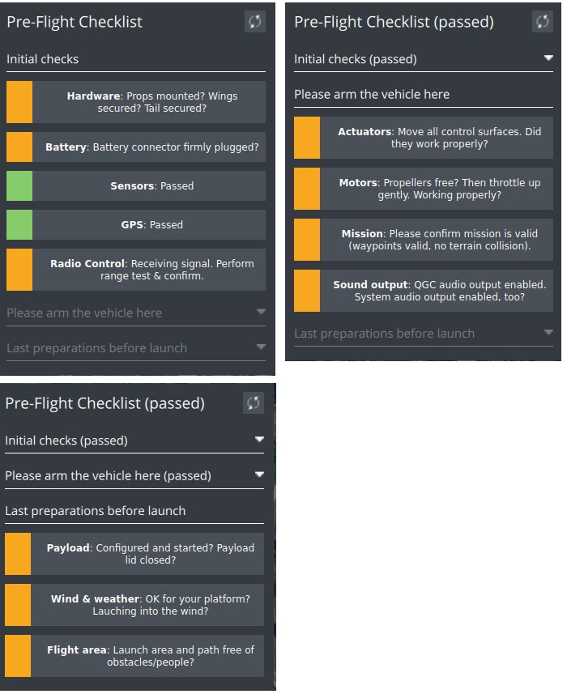  <!-- image79.png -->

## Video/Map Switcher {#switcher}

The Fly View video/map switcher is used to toggle the camera video feed or the map to the foreground.

 \ <!-- image201.png -->

Additional controls are displayed in the switcher if it is selected:

- Resize the switcher window by dragging the top right corner.
- Collapse/expand the switcher by pressing the arrows in the lower left.
- Make the switcher a separate window by selecting the icon in the top left corner (desktop systems only).
- Change the [map type](#map-types) using the icon on the bottom right.

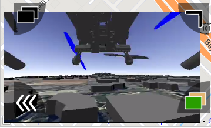  <!-- image118.png -->

## Camera View

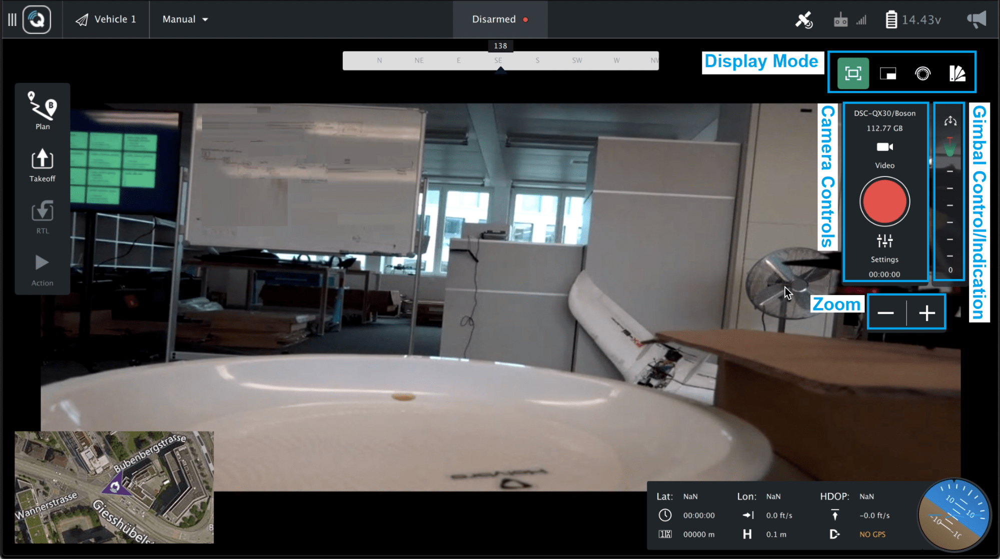

*QGC-Gov* has been specifically designed to integrate with cameras that support both visible light and IR video streams, and which can be directed independent of vehicle orientation using a joystick controlled gimbal.

The Fly View camera controls are composed of the following elements:

- Video display mode control (Dual-stream): Select the video source/display mode: visible light (full screen), picture-in-picture (thermal in visible), IR/thermal (full screen). Cycle through available thermal palettes and apply to IR video.
- Camera controls: Capture photos or videos, configure camera settings.
  Display high-level information
- Gimbal indicator/control: Gimbal indication and pitch (vertical) control
- Zoom controls: Continuous zoom in/out

### Video Display Mode Control

 

QGC-Gov supports both Electro Optical (EO) and Infrared (IR) video streams.
The video display mode control is used to specify which video stream(s) are displayed, and to select the thermal palette used for IR streams.

> **Note:** QGC-Gov supports a number of pre-integrated cameras.
> The options displayed in the control depend on vehicle camera support/capabilities.

The button actions from left to right are:

- Visible light video stream display full screen.
- Picture-in-picture display (full-screen visible light stream with window containing thermal stream).
  Note that visible-in-thermal picture-in-picture is not currently supported.
- IR/thermal video stream display full screen.
- Pop up dialog to cycle through available thermal palettes.
  If a thermal video stream is displayed the selected palette is immediately applied.

Screenshots for each of the modes are shown below.

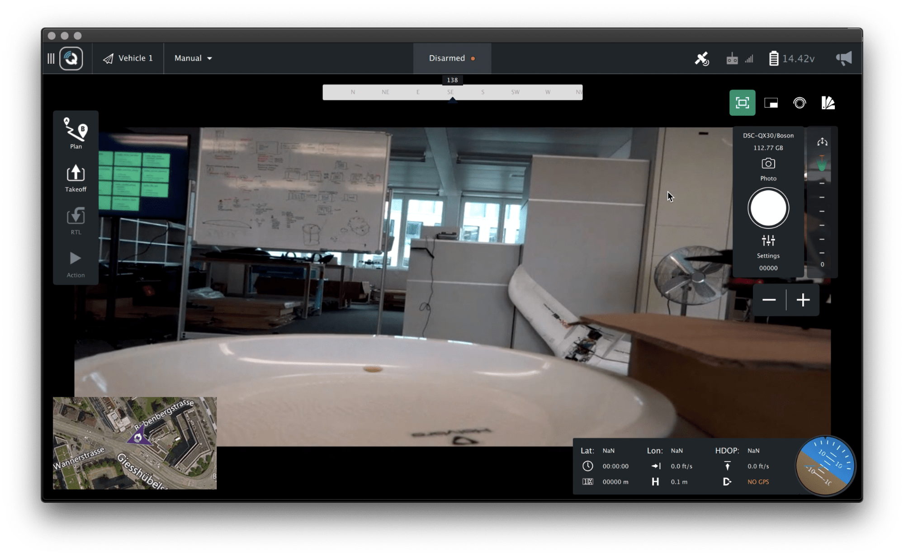

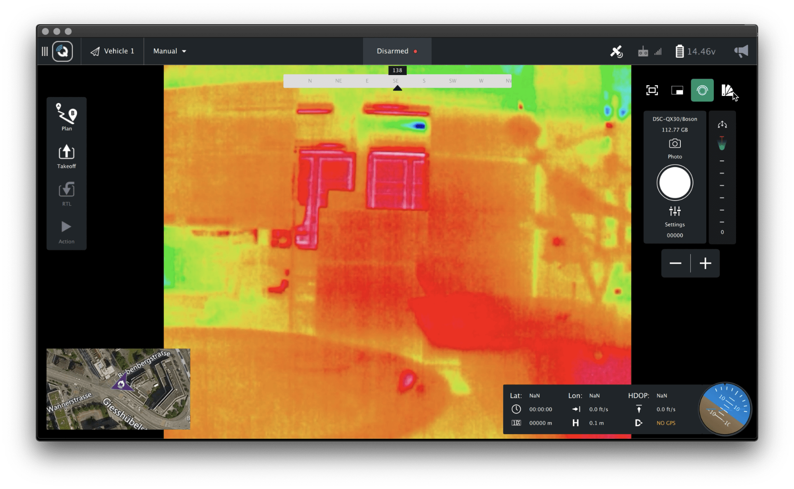

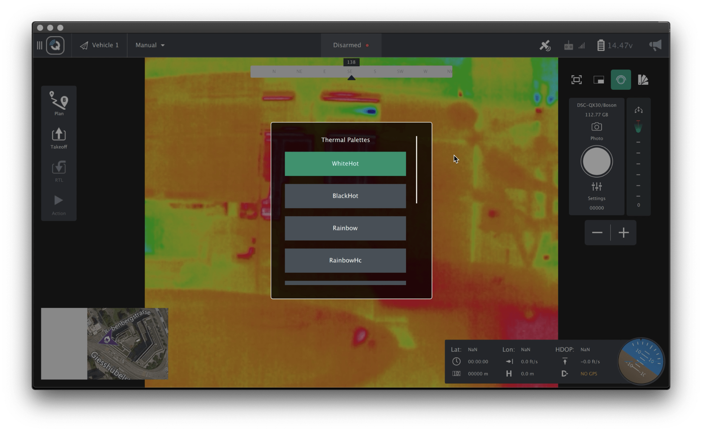

### Camera Gimbal Control

The Camera-Gimbal control is used to control the camera and display the gimbal pitch and yaw.
By default the gimbal slider part of the control can also be used to *control* camera pitch (but not yaw).
There is a setting to disable pitch control using the slider, and another that enables a separate on screen joystick for gimbal control.

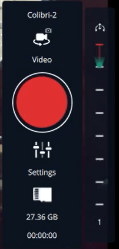

The parts of the control are discussed separately below.

#### Camera Controls

The camera controls are used to capture video or images and to switch between the image and video capture modes.
They also allow you to configure the camera settings for each mode and display high level information about the camera.

The views for video and photo control are shown below:

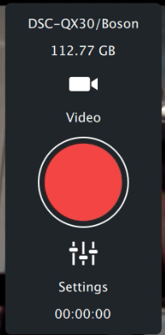 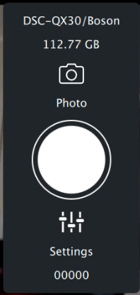

The controls, in order are:

- Connected camera
- Free SD card memory
- Camera mode
- Capture
- Open settings to configure current capture mode
- Elapsed time for current video (Video mode) / Number of captured pictures (Camera mode)

#### Gimbal Indicator/Slider

A gimbal allows camera pitch (up/down) and/or yaw (left/right) movement to be controlled independently of vehicle movement.
*QGC-Gov* is expected to be used on hardware with a dedicated gimbal joystick.

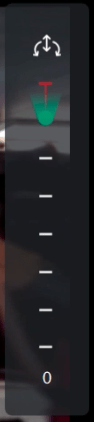

The gimbal indicator *displays* the current camera pitch and yaw on a vertical slider:

- The position of the green icon indicates the pitch, where the top of the bar indicates 0 degrees (straight ahead).
  The current pitch is also displayed in digits at the bottom of the indicator.
- The angle of the green icon relative to the slider indicates the yaw.
- The red area at the top indicates a pitch where the camera may capture propeller movement.

By default you can also change the pitch (but not yaw) by dragging the green icon up and down the indicator/control.

> **Note:** An [on-screen gimbal joystick](#gimbal-control-virtual-joystick) can alternatively be enabled that controls both pitch and yaw (if supported by hardware).

### Gimbal Control (Virtual Joystick)

The *Gimbal Control* is an on-screen gimbal joystick. It can be enabled as an alternative to the camera-gimbal control, and allows both gimbal yaw and pitch to be set.

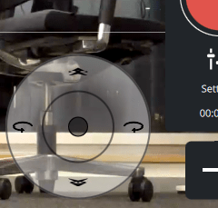

The virtual joystick is enabled in the [Gimbal Settings](#camera-and-gimbal-settings).
The setting **Use Camera Gimbal Control** must be set to *Off*, after which **Use Gimbal Joystick Control** can be set to *On*.

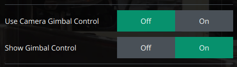

### Zoom controls

 

Continuous zoom out / in via a tap+hold interaction.

### Camera and Gimbal Settings

Camera settings for photo and video are accessed from the [Camera Controls](#camera-controls) settings icon.

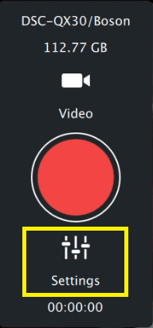

The options presented depend on the attached camera and camera mode (video/photo).
For example: ISO, white balance, brightness, sharpness, video frame rate, exposure mode, etc.

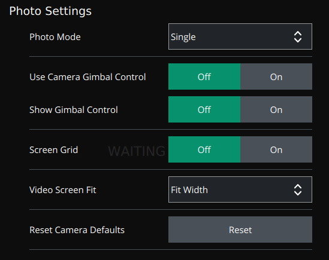
<!--  -->

The settings that are *independent of the camera type* are listed below.

- `Photo mode`:
  - `Single`: Capture image
  - `Timelapse`: Capture image after specified interval.
    - `Photo Interval`: Interval for timelapse capture.
      
- `Use Camera Gimbal Control` (`On` | `Off`): Enable the gimbal indicator to be used as a control for setting the gimbal pitch (disables the on-screen gimbal joystick).
- `Show Gimbal Control` (`On` | `Off`): Enable [on-screen gimbal joystick](#gimbal-control-virtual-joystick). <!--  -->
- `Screen Grid` (`On` | `Off`): Overlays 3x3 grid over the video feed (aids image alignment). <!-- 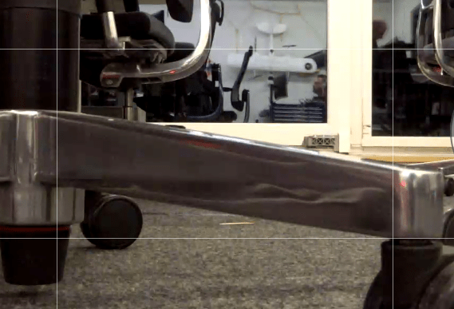 -->
- `Video Screen Fit`: Full screen video display
    - `Fit Height`: Fit to height
    - `Fit Width`: Fit to width
    - `Stretch`: Stretch to fill screen
- `Reset Camera Defaults`: Reset camera/gimbal to default settings.

## Flight Modes

Flight modes provide different types of autopilot assistance to a pilot, including automation of common operations like *takeoff* and *landing*, execution of fully autonomous missions, and changing how the vehicle responds to pilot input during manual flight (for example by making it easier to regain level flight, hold the vehicle to a fixed path or position, etc.).

The current mode is displayed in the [flight mode selector](#flight-mode-selector) in the [Fly View app bar](#fly-view-app-bar).
The selector can be opened to select [Position](#position-mode) or [Altitude](#altitude-mode) mode.
Other modes are selected from the [Fly Toolbar](#fly-toolbar), such as [Takeoff mode](#takeoff-mode), [Return mode](#return-mode), and [Land mode](#land-mode), or other controls.

The most important flight modes and tasks are covered at high level below.

> **Note:** Flight Mode behaviour depends on vehicle type and configuration.
> The information here covers _default behaviour_ at high level.

### Position Mode

*Position Mode* relies on GPS, and is the easiest and safest *manual* flight mode, in particular for new fliers.
*Position Mode* is selected in QGC from the mode selector in the application status bar.
This is also the default mode if you move the sticks in an automatic mode.

On multicopter the roll stick controls vehicle speed in left-right direction (relative to the "front" of the vehicle), pitch stick controls forward-back speed, yaw stick controls rate of rotation above the ground plane, and throttle stick controls the speed of ascent-descent.
When the sticks are released/centered the vehicle will actively brake, level, and be locked to a position in 3D space — compensating for wind and other forces.

On fixed wing vehicles the throttle determines airspeed (at 50% throttle the aircraft will hold its current altitude with a preset cruise speed).
Pitch is used to ascend/descend. Roll, pitch and yaw are all angle-controlled (so it is impossible to roll over or loop the vehicle).
When the sticks are released/centered, the vehicle will level and fly a straight line ground track in the current direction — compensating for wind and other forces.

### Altitude Mode

*Altitude Mode* (also known as *Altitude Hold*) is a safe and easy-to-fly *manual* flight mode that does not rely on GPS.
It shares the **same** flight control behaviour as *Position Mode*.
The only difference is that when the sticks are released and centered the autopilot holds the altitude but not *horizontal position or heading*.

When the sticks are centred in Altitude Mode, a multicopter will continue moving forward with existing momentum until slowed by air resistance, and will move in response to wind and other forces.
A fixed wing vehicle will hold level and straight flight, but will not hold course in response to wind etc.

*Altitude Mode* is selected in QGC from the mode selector in the application status bar.

### Return Mode

*Return Mode* causes the vehicle to fly a clear path to a safe location.
The mode can be activated manually by selecting the **RTL** button ([Fly View Toolbar](#fly-view)) or using a pre-programmed RC switch.
It may also be entered automatically as a response to a vehicle failsafe being triggered (e.g. low battery).

The return behaviour depends on vehicle settings, and may follow a mission path and/or mission landing pattern (if defined).
By default a fixed wing vehicle will use a landing pattern defined in a mission while a multicopter will fly to the home location and land.

### Takeoff Mode

*Takeoff Mode* initiates the automatic takeoff sequence.
The mode can be activated by selecting the **Takeoff** button ([Fly View Toolbar](#fly-view)) when landed or using a pre-programmed RC switch.

On multicopter takeoff causes the vehicle to climb vertically until it reaches the *takeoff altitude*, and then switch to [Hold Mode](#hold-mode).
On fixed wing, the launch behaviour depends on the configured takeoff mode (catapult/hand-launch mode or runway takeoff mode).

### Land Mode

*Land Mode* initiates the automatic land sequence.
The mode can be activated by selecting the **Land** button ([Fly View Toolbar](#fly-view)) when flying or using a pre-programmed RC switch.

On multicopter the vehicle will just descend and land.
Fixed wing landing depends on vehicle configuration.

### Hold Mode

*Hold Mode* is an automatic mode used to hold a vehicle at a particular location.

A multicopter in this mode will hover at its current position and altitude (maintaining position against wind and other forces) while a fixed-wing vehicle will hold altitude and circle the current position.

Hold mode is entered automatically after takeoff and landing modes complete, and when pausing a mission.
It can also be activated with a pre-programmed RC switch.

In some cases Hold mode can be used for high level vehicle control, including goto and orbit.

### Mission Mode

*Mission Mode* is used to execute a pre-planned mission.
This mode is automatically activated when you start a mission in QGC.

# Fly using High-Level Commands

_Fly View_ enables simple directed flight and image capture using high level commands: takeoff, fly to location, fly to location and orbit,
point camera, take picture, land where you are, return home and land, etc.

The command mechanisms are very simple:

- *Toolbar buttons* are used to choose basic flight commands that don't need you to specify a location: takeoff (with optional altitude), land, return to takeoff position and land, pause at current location/altitude.
  Buttons that are not relevant to the vehicle state are either disabled or hidden (e.g. takeoff is only available when you are landed).
- *Map press* is used for operations that require a location; e.g. to goto a particular location, orbit a location

In each case the action must be acknowledged using a confirmation dialog slider.

> **Note:** Takeoff is a precondition for all other operations (except for a multicopter mission, which will takeoff automatically).
> You can takeoff using a joystick, or using the toolbar action.

## Takeoff, Land, RTL, Pause

<!-- all of this might be better structured into "fly actions" subsection - extended to show the options -->

The basic flight operations are all initiated by pressing the appropriate button on the toolbar and then using the slider on a [confirmation prompt](#confirmation-prompts):

- **Takeoff** - Arm and takeoff to specified altitude (altitude specified using vertical slider).
- **Land** - Land immediately at current location
- **RTL** - Return to home (takeoff) location and land.
- **Pause** - Pause current operation and wait at current location/altitude.

## Goto Location

To send the vehicle to a particular location:

1. First takeoff
2. Choose the map location where you want the drone to go and select the **Go to location** option:

   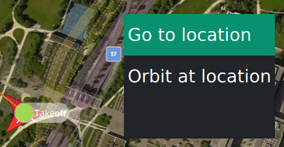
3. Confirm using the slider (note the target location is shown on the map):

   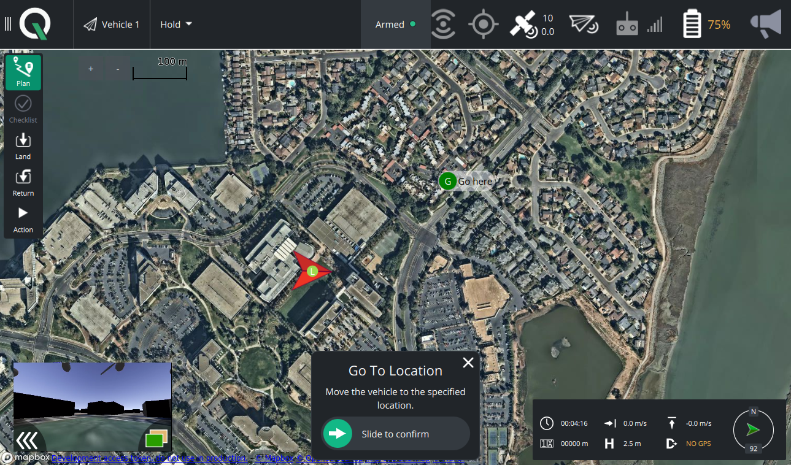

## Orbit Location

To orbit a particular location:

1. First takeoff
2. Choose the map location where you want the drone to orbit and select the **Orbit at location** option:

   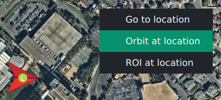
3. Drag and drop the center of the orbit and its radius on the map using the white markers provided.
   You can also set the altitude using the vertical slider on the right.

   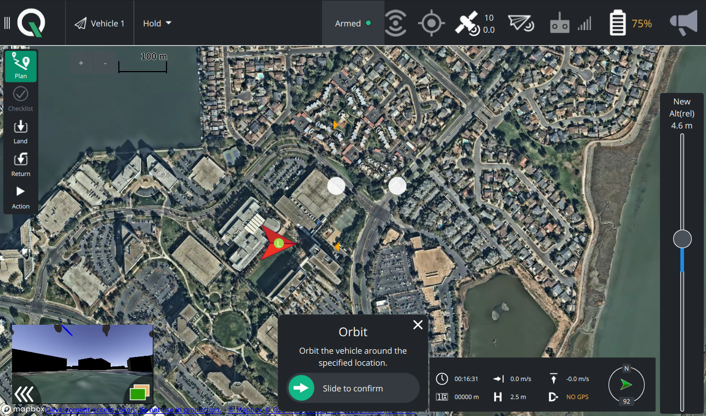
4. When you're satisfied, confirm using the slider.
5. The vehicle will then fly to the location and orbit.

You can use the sticks on the controller to change the radius, speed, and direction of rotation.

# Fly Manually

QGC-Gov isn't required for manual flight, but can make some tasks easier:

- [Viewing vehicle state and flight information](#vehicle-state-and-flight-information) allows pilots to see the map, historical and planned flight path, geofences, rally points, speed, altitude, direction, battery capacity, and much more.
- [Taking off, landing, flying home and landing actions](#fly-using-high-level-commands) can be triggered from the [fly tools](#fly-tools).
  Automating these operations is safer and easier than flying them manually.
- [Tracking a particular target](#region-of-interest-position-mode) with the camera (region of interest).

## Supported Manual Modes

QGC-Gov explicitly supports two manual modes (which can be enabled through the app):

- [Position mode](#position-mode) is the easiest and safest manual flight mode.
  It has intuitive stick controls and is impossible to flip.
  This mode holds position when the sticks are centered, quickly damping any momentum and resisting external forces like wind.
- [Altitude mode](#altitude-mode) is very similar to *Position mode*, except that it cannot hold horizontal position/heading (it only holds altitude).
  When the sticks are centered the vehicle will not immediately stop (but will slow down in response to wind resistance).
  The vehicle will also continue to move in response to wind and other external forces.

Other manual modes may be accessible outside of *QGroundControl* (i.e. though RC controller switches).

> **Note:** *Position mode* is highly recommended for new fliers, and for any flier who needs a safe and stable platform (e.g. for photography).

## Enabling Manual Modes

> **Caution:** Ensure that sticks are centered before enabling manual modes!

The manual modes can be enabled using the mode selector as shown.

## Region of Interest

QGC-Gov allows users to set a *Region Of Interest* (ROI) on the map in fly view.
The camera will then track this ROI in when flying in [position mode](#position-mode) (only).

To set the ROI:

1. Ensure you are flying (the ROI cannot be set when landed).
2. Select the target location for the ROI on the map.
   This will popup the map action menu.
   
   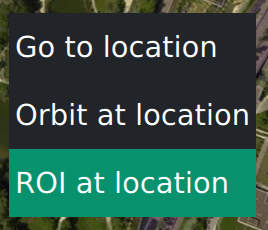
3. Acknowledge the confirmation prompt:

   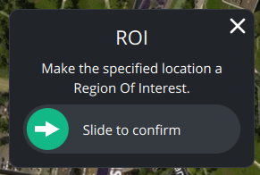
4. QGC-Gov will then add an ROI marker at the selected position, and mark the ROI status icon (application top bar) green ("enabled").

   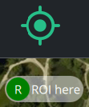

   > **Note:** the ROI isn't *actually* enabled until the vehicle is in position mode!

To remove an ROI, select the ROI status icon in the toolbar and select the popup option: **Disable ROI**.

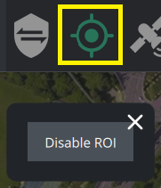

# Fly a Mission

After you’ve [planned a mission](#mission-plan) and uploaded it to the vehicle, switch to *Fly View* in order to run it.

The UI is very simple.

- If a mission has been uploaded QGC will automatically prompt you to:

  - Start a mission when you’re landed
  - Continue a mission after taking off (outside of a mission)
  - Restart a mission if you’ve paused it.

- Pause the running mission by selecting the toolbar **Pause** button (and acknowledge the confirmation prompt).
  Restart using **Continue** prompt (if not visible, display it using the Action button).
  
  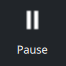
- [Pause, Edit and Continue a mission](#pause-edit-continue-a-mission) using the **Pause** and **Edit** buttons (see below)
- Pause and go to a location specified on the map.

  - Simply select a position on the map to add a **Go here** marker and display a *Goto Location* prompt.
    Use the slider to confirm the action.

    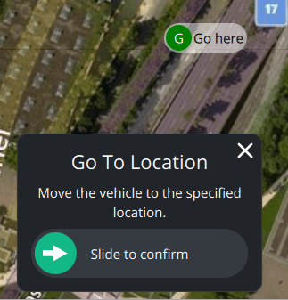
  - The mission can be continued by acknowledging the *Continue Mission* prompt that appears after setting the Goto target (use the **Action** button to display the prompt if it is not visible).

- Use the **Action** button to display valid mission options for the current vehicle state: *start*, *continue*, *pause*, *restart*.

  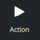

  It can be used to bring back a prompt that has been dismissed.

## Pause-Edit-Continue a Mission

QGroundControl makes it an almost-seamless operation to pause, edit and then continue a mission.

> **Note:** QGroundControl switches to [Plan View](#plan-view) for editing, and then returns you to *Fly View* to continue the mission towards the same waypoint (if available). 

To pause and edit an ongoing mission:  

1. Pause the current mission (select the **Pause** button and confirm using the slider).  
   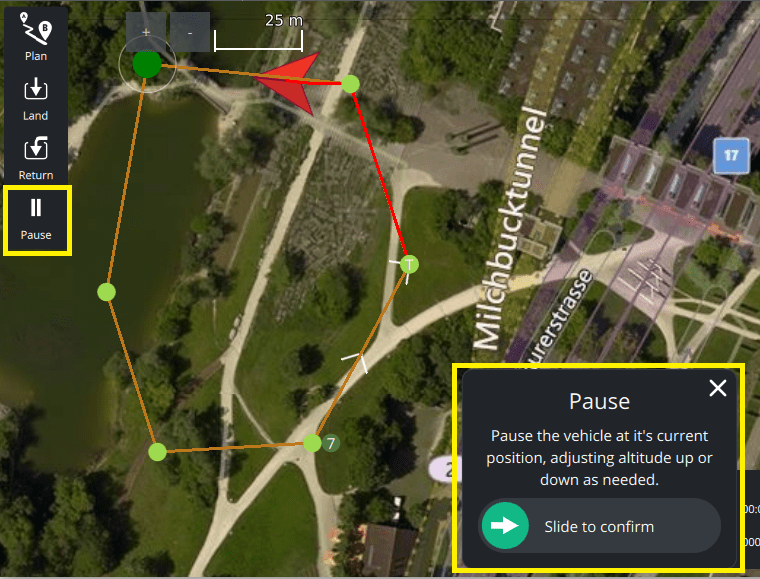
2. Press the **Edit** toolbar button to switch to the Plan View (this appears after pausing the mission)  
   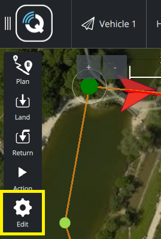
3. [Plan the mission](#plan-view) (as usual). You can add, remove, delete, move or change any item.
4. Select **Continue Mission** on the top right to upload the changed mission and switch back to *Fly View* (or **Cancel Changes** to clear the current changes and stay in the same view).
   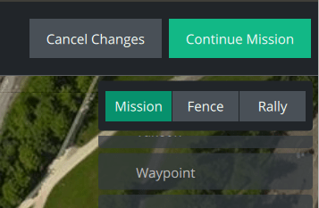
5. Check the highlighted/current target waypoint is correct:

   - The mission will continue towards the original target waypoint, unless this item was deleted.
   - You can change the target item by selecting another waypoint on the map and then confirming the waypoint change using the slider.

6. Acknowledge the **Continue** prompt slider to restart the mission (if this is not visible, you can bring it to the foreground using the **Action** tool).

# Plan View

*Plan View* is used to define different types of *plans*:

- ​[Missions](#mission-plan): Autonomous missions, including ground and building surveys.
- ​[GeoFence](#geofence): Virtual fences that define areas the areas the vehicle can safely move.
- ​[Rally Points](#rally-points): Alternative safe destinations when in Return mode.

Each type of plan is edited separately.
The [Plan Type Selector](#plan-type-selector) specifies the current type, and hence both the tools and item editors that are displayed.

There are individual topics with detailed instructions on each type of plan and survey.

## Plan UI Overview

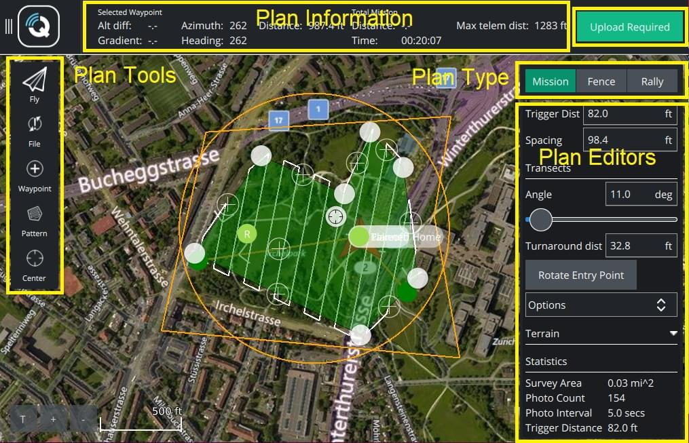

This topic provides an overview of the main UI elements (in particular those that are common to all plan types).

### Upload Button

The *Upload Button* sends the current mission, geofence and rally point plans to the vehicle.

The button has two states.

| Appearance | State | Description |
| --- | --- | --- |
|  | Upload Required | Plan has changed since last upload. |
| ​​​   | Upload          | Plan has not changed on this ground station (but can be uploaded anyway). |

### Plan Type Selector

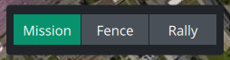

The *Plan Type* selector sets the current plan type being edited: mission (including surveys and scans), geofence, rally points.

### Plan Item Editors

*Plan Item Editors* are displayed below the *Plan Type* selector.
Different editors are displayed for each type of plan:

- **Missions:** A list of editors, one for each item in the mission (waypoint, commands, etc.)
- **GeoFence:** An editor to add/remove geofence definitions, and to select the current geofence region for editing on the map.
- **Rally Points:** Editor to edit or delete the currently selected rally point (on the map).

### Plan Information

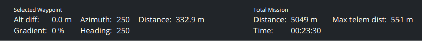

The *Plan Information* section contains information that is useful for planning *missions*, including details about both the currently selected waypoint and the whole mission (it shows the same information for all plan types).

For more details see [Mission Plan \> Mission Information](#mission-information).

### Plan Tools

The *Plan Tools* provides tools for working with plans, including adding waypoints, inserting survey patterns, saving/loading/uploading/downloading plans etc. Some of the options are only displayed when working on a particular type of plan.

Icon | Name | Plan Type | Description
--- | ---- | ---- | -------------
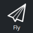  | Fly           | All     | Switch to Fly View (e.g. in order to fly a mission)
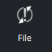  | File/Sync     | All     | File operations (create new plan, save plan, load plan) and sync operations (upload/download plan from vehicle, clear plan on vehicle).
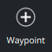 | Waypoint      | Mission | Select to enable adding new waypoints to the map.
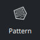 | Pattern tools | Mission | Add or load a survey pattern - survey (area), structure, corridor.
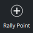 | Rally Point   | Rally   | Add a rally (safe) point.
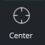  | Centre map    | All     | Center map on mission, home, vehicle, all items, or specified location

#### File/Sync Tools

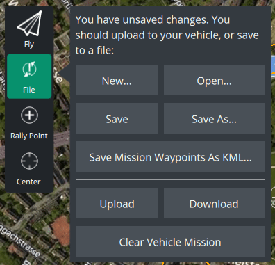

The Plan **File/Sync Tool** provides options to create a new plans, load/save plans on the ground station computer, and upload/download/clear the plan on the vehicle.

> **Tip:** Only valid options are enabled (e.g. *Download* is greyed out if there is no mission on the vehicle).

#####  File Options

Option | Description
--- | ------
New... | Clear plan on QGC and vehicle.
Open... | Open plan file from storage, clearing the current mission in the ground station. The plan on the vehicle is not affected. QGC can open **.plan** files (and also a number of legacy formats: **.mission**, **.txt**, **.waypoints**).
Save | Save previously opened or saved plan under same name. QGC prompts to "**Save as**" if the file is new.
Save as... | Save current plan under new name (the save format is _.plan_).
Save Mission Waypoints as KML ... | Save current mission (only) as a KML file. KML files are used by Google Earth.

##### Vehicle Options

The vehicle options upload, download and clear plans to/from/on the vehicle.

Option                | Description
--- | ------
Upload                | Upload plan to vehicle. Existing plans on the vehicle are cleared.
Download              | Download current plan from vehicle. The current plan on the ground station is cleared.
Clear Vehicle Mission | Clear plan on vehicle and QGC. Disabled if no vehicle is connected.

### Map Tools

The map responds to platform-specific mechanisms for map control.
For example, on a tablet you can drag the map to pan, and use pinch gestures to zoom.

In addition, the **Plan Tools \> Center** tool can be used to control how the map is centered.

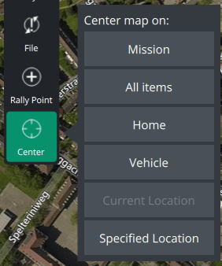

Option | Description
--- | -------
Mission | Center/zoom map to include all mission waypoints.
All items | Center/zoom map to include all plan items (missions, geofences, rally points).
Home | Center map on home location (normally where vehicle arms and takes off).
Vehicle | Center map on vehicle location. Disabled if no vehicle is connected
Current Location | Center map on ground station location. Disabled if ground station does not have location/GPS.
Specified Location | Center map on specified location. Selecting this option opens the _Specify Position_ dialog (right of the screen). Enter geographic, UTM or MGRS position information, then press the associated **Set...** button to make it the new map center. 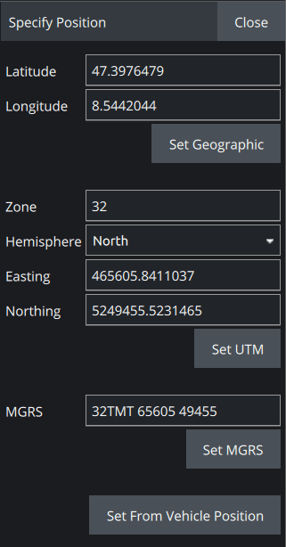

> **Note:** Additional, for _mission editing_ (only) the bottom left of the map includes a scale marker, and on-screen buttons for zooming the map in/out.
> 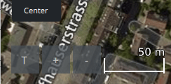

### Map Grid

The map can be configured to overlay a map grid in both Plan and Fly Views.
For more information see: [Fly View\> Map Grid (MGRS)](#map-grid-mgrs).

# Mission Plan

Missions plans are used to define fully autonomous flight operations, including scans and surveys.
They are are created in *Plan View* when the [Plan Type](#plan-type-selector) is set to **Mission**.

There are a number of different "types" of missions:

- [Manual Missions](#manual-waypoint-mission): The flight path is defined as a series of waypoints and other mission commands.
- ​[Survey Missions](#survey-mission): An area survey defined by an arbitrary polygon.
- ​[Structure Scans](#structure-scan-mission): A survey over a vertical surface with arbitrary polygonal ground footprint (e.g. a building)
- ​[Corridor Scans](#corridor-scans): A survey that follows a poly-line (e.g. a road).

> **Note:** Surveys/scans provide a simpler and more flexible way to define a survey over an arbitrary region than manually adding waypoints.

This section explains the UI elements used in mission planning.
There are also specific topics for working with each type of mission.

## Mission Plan UI Overview

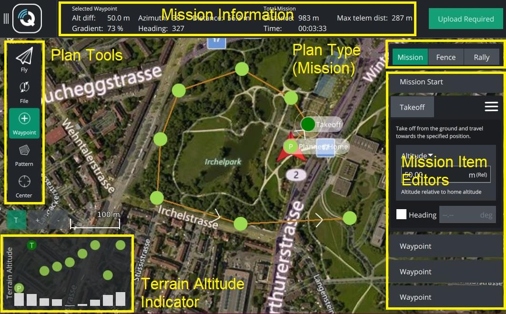

This section provides an overview of the main UI elements used for mission planning.

General information that is common to all plan types (e.g. related to uploading missions, map and file tools) is covered in [Plan UI Overview](#plan-ui-overview).

### Mission Information

The plan information (application top bar) provides useful statistics for planning both individual waypoints and the whole mission.

> **Tip:** In particular the total mission statistics can be used to verify that the total mission time does not exceed battery capacity, and whether the vehicle remains in range of the ground station. 

The *Selected Waypoint* section fields are relative to the planned home position:

Field | Description 
--- | ------
Alt diff | Relative altitude with respect to planned home position.
Gradient | Gradient (%) with respect to planned home position. 0 indicates waypoint and home at the same altitude.
Azimuth  | Heading of current waypoint with respect to previous waypoint (in degrees, clockwise from North=0°).
Heading  | Heading of vehicle to next waypoint (in degrees, clockwise from North=0°). For the last waypoint the vehicle is assumed to continue following the path of the current line (i.e. the heading is the same value as the azimuth).
Distance | Distance to planned home position.

The *Total Mission* section contains information about the whole mission.

Field | Description
--- | ------
Distance       | Total distance of mission.
Max telem dist | Maximum distance from ground station (should not exceed telemetry radio range).
Time           | Expected/calculated time to complete mission (H:M:S).

### Terrain/Altitude Indicator

> **Note:** This indicator may not be displayed on small screens (if there is not enough space below the [Plan Tools](#plan-tools)).

The Terrain Indicator shows the relative altitude and distance (from planned home)

- *Circles* indicate the altitude for each waypoint/pattern (the dark green circle indicates the current waypoint).
  Circle text indicates particular mission item types.
- *Vertical bars* indicate the terrain altitude at the waypoint position.
  If the planned vehicle altitude is under the terrain altitude the bar is shown in red.

The legend for the circle text is given below.

Text | Type
--- | ------
P | Planned home
T | Takeoff waypoint
S | Survey scan or Structure scan
C | Corridor scan

### Plan Tools (Mission)

The [Plan Tools](#plan-tools) that are displayed when working with missions are listed below.

Icon | Name | Description
--- | --- | ---------
 | Fly | Switch to _Fly View_ (in order to fly a mission)
 | File/Sync | File operations (create, save or load plan) and sync operations (upload/download plan from vehicle, clear plan on vehicle).
 | Waypoint | Select to enable adding new waypoints to the map.
 | Pattern tools | Add or load a [survey](#survey-mission) (area), [structure scan](#structure-scan-mission), [corridor scan](#corridor-scan), or **Load KML/SHP...** file containing a pattern definition. 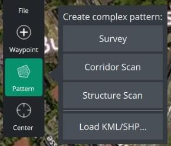 
 | Centre map | Center map on mission, home, vehicle, all items, or specified location

### Mission Command List

The *Mission Command List* (below the [Plan Type Selector](#plan-type-selector)) contains item editors for all the waypoints, surveys/scans, and commands in the mission.

The first item is the [Mission Start](#mission-start-editor-defaults), which contains default and initial settings for the mission.

Individual mission items can be selected on the map or in the mission list to edit their settings (other than location, which is generally set using the map).

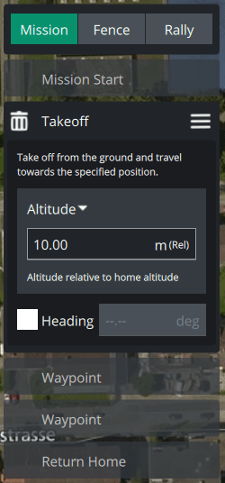

Detailed information about the command list can be found in: [Manual/Waypoint Mission](manual-waypoint-mission).

## Creating a Mission

To create a completely new mission, you can first clear away any existing mission using the **File \> New** tool.

There are four main "types" of mission - waypoint missions, survey missions, structure scans, and corridor scans.
The surveys/scan missions are just waypoint missions that happen to include patterns of the different types.

For more information about how to create each type of mission:

- [Manual/Waypoint Mission](manual-waypoint-mission)
- [Survey (Mission)](#survey-mission)
- [Structure Scan (Mission)](#structure-scan-mission)
- [Corridor Scan (Mission)](#corridor-scan)

# Manual/Waypoint Mission

A manual (or "waypoint") mission is an autonomous mission where the flight path is explicitly defined on the map using waypoint mission items.

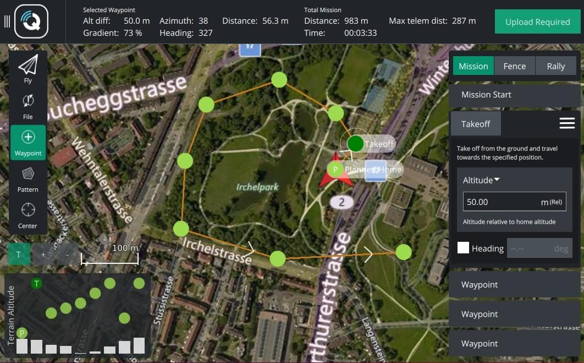

The mission path and direction are shown on the map, with filled circles for the waypoints.
Other important types of points are marked with labeled points (e.g. "**T**" for takeoff, "**P**" for Planned Home).
A mission item can be selected for editing from the map or the mission item list; it is then highlighted using a larger filled green circle and a description) and its editor is opened.

Waypoints are added by first selecting the associated tool in the *Plan Toolbar*, and then selecting the desired position for the item on the map.

When added to the map, waypoint items editors are also added in the mission list on the right hand side.
These editors can be used to change mission items to different types and delete them.

This topic shows how to create a basic manual mission.

## Create a Manual Mission

This example creates a simple end-to-end mission that includes takeoff, setting waypoints, and landing.

To create a manual mission:

1. Open the *Plan View* and select the **Mission** button (top     right).

   ​
2. From the *Plan Tools*, select **File \> New** to clear any existing mission.
3. Check that the [Mission Start Editor](#mission-start-editor) settings are correct for the planned survey.
   In particular, check that the altitude is high enough to avoid obstacles when travelling to the first waypoint.

   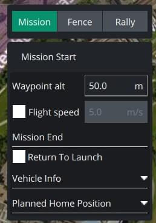
4. Select the **Return to Launch** box (shown above).
   This makes the mission land at the takeoff point when on completion.
5. Add a takeoff waypoint.

   - Select **Plan Tools \> Waypoint** to enable adding waypoints
     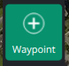
   - Select on the map to add a *Takeoff* item.
     The first waypoint added to a mission is automatically turned into a Takeoff item!
     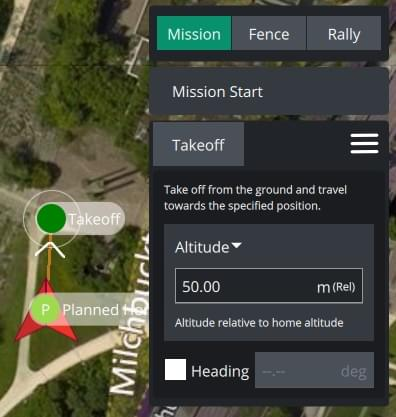
   - An (open) *Takeoff Editor* is also added to the mission item list.
     If needed, use the editor to modify the altitude and/or heading.

6. Add a waypoint (or waypoints):

   - Select **Plan Tools \> Waypoint**.to enable adding waypoints

     
   - Select on the map to add a *Waypoint* item.

     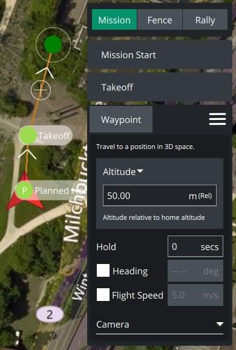 
   - An (open) *Mission Waypoint Editor* is also added to the mission item list.
     If needed, use the editor to modify the altitude, heading, or flight speed.
     Camera triggering can also be configured from this panel (and will apply until the next waypoint).
   - Add additional waypoints where needed on the map (along the desired path).
   - To insert waypoints *between* existing waypoints, select the mission item before where the new item is to be added (either on the map or its editor) then select the menu on the editor and choose the option: **Insert waypoint**.

7. Add a different type of mission item (by changing the mission item type).

   - Add two waypoints. The first should be the next planned waypoint, while the second will be changed into a new type of mission item.
   - Select the heading on the "placeholder" waypoint

     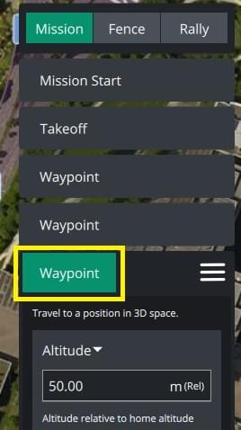

    This will launch the *Select Mission Command* prompt.
   - Select a Category and an option. Below we show *Camera* and item *Cancel ROI*.

     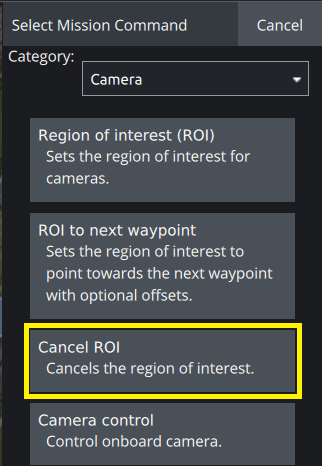
   - The waypoint will be replaced with the *Cancel ROI* item.

     

Many other types of mission items and operations are possible.
For more information see the following sections.

## Mission Start Editor (Defaults)

The *Mission Start Editor* is the first item in the mission command list.
It is used to specify settings that apply to the whole mission (e.g. planned home), and settings for the first item (e.g. the altitude).
It can also be used to reset the altitude and flight speed for all mission items.

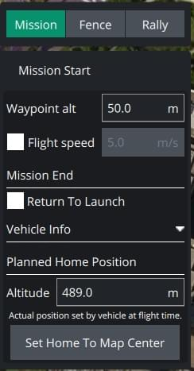

#### Mission Start Panel

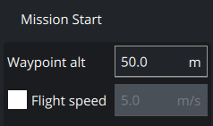

Set the initial altitude and (optionally) flight speed for the mission (the values can be changed in waypoints, and will persist to subsequent waypoints).

If the altitude is changed after a mission has been defined, the user is prompted to confirm whether the change should apply to all waypoints.

​Setting | ​Description
--- | ------
Waypoint alt | Default altitude for the first mission item added to a plan (subsequent items take an initial altitude from the previous item). This can also be used to change the altitude of all items in a plan to the same value; users will be prompted if the value is changed when there are items in a plan.
Flight speed | Set a flight speed for the mission that is different than the default mission speed.

#### Mission End Panel

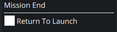

Check to complete the mission by returning to the launch point.

#### Vehicle Info Panel

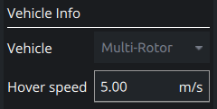

The *Vehicle Info* section allows the default vehicle speed to be specified, which is used to estimate mission duration.

The vehicle type can be specified when *not connected to a vehicle* (if connected it is pre-set).
The *type* determines the set of mission commands that can be used in a mission.

​Setting | ​Description
--- | ------
Vehicle      | Vehicle type. One of: *Fixed Wing*, *Multi-Rotor*, *VTOL*, *Rover*, *Sub*.
Hover Speed  | Flight speed for multi-rotor (and VTOL in multi-rotor mode). Used to calculate mission flight times.
Cruise Speed | Cruise speed for fixed wing (and VTOL in fixed-wing mode). Used to calculate mission flight times.

#### Planned Home Position Panel

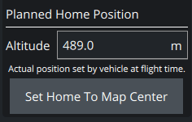

The *Planned Home Position* (a.k.a. Launch point) simulates the vehicle's home/launch position while planning a mission, allowing end-to-end mission planning even if no vehicle is connected.

> **Note:** The planned home position has no impact on flying the mission. The actual home position of a vehicle is set by the vehicle itself when arming.

The planned home point is added to the map at the location of the vehicle (shown as a circle with the text "**P**").
If no vehicle is connected a placeholder is added along with the first waypoint.

The point can be moved via drag/drop, or its position can be set using the **Set Home to Map Center** button.
Its altitude can be set using this panel.

​Setting | ​Description
--- | ------
Altitude               | Enter the altitude of the planned home position.
Set Home to Map Center | Select to set the home location to the current center of the map.

## Mission Command Editors

There are many different types of mission items/editors.
These can be used by changing the type for a waypoint or other mission item (select the item heading).

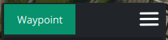

This section lists all the mission editor types, and provides details for a small subset of the most important types.

### Mission Editor List

All the mission editors are listed below (other than those for patterns).

| Category       | Command                                     | Description                                                                            |
|----------------|---------------------------------------------|----------------------------------------------------------------------------------------|
| Basic          | [Waypoint](#mission-waypoint-editor)        | Travel to a position in 3D space.                                                      |
| ​               | Return Home                                 | Send the vehicle back to the home position.                                            |
| ​               | Land                                        | Land vehicle at specified location.                                                    |
| ​               | [Takeoff](#mission-takeoff-editor)          | Takeoff from the ground and travel towards the specified position.                     |
| Loiter         | Loiter                                      | Travel to position and loiter indefinitely.                                            |
| ​               | Loiter (time)                               | Travel to position and loiter for a specified time.                                    |
| ​               | Loiter  (altitude)                          | Travel to position and loiter until specified altitude reached.                        |
| VTOL           | VTOL takeoff and transition                 | Takeoff in VTOL mode, transition to forward flight, and fly to the specified location. |
| ​               | VTOL transition and land                    | Transition to VTOL mode and land.                                                      |
| ​               | VTOL transition                             | Perform flight mode transition (to specified mode).                                    |
| Advanced       | Delay until                                 | Delay until specified time.                                                            |
| ​               | Jump to item                                | Mission will continue at the specified item.                                           |
| ​               | Set servo                                   | Set servo to specified PWM value.                                                      |
| ​               | Configure mount                             | Configure the vehicle mount (e.g. gimbal).                                             |
| ​               | Control mount                               | Control the vehicle mount (e.g. gimbal).                                               |
| Conditionals   | Wait for Heading                            | Delay the mission until the specified heading is reached.                              |
| Flight control | Change speed                                | Change speed and/or throttle setpoints.                                                |
| ​               | Land start                                  | Marker to indicate the start of a landing sequence.                                    |
| Camera         | [Region of interest (ROI)](#mission-region-of-interest-roi-editor) | Sets region of interest for the camera.                         |
| ​               | ROI to next waypoint                        | Sets the region of interest.                                                           |
| ​               | [Cancel ROI](#mission-cancel-roi-editor)    | Cancels the region of interest.                                                        |
| ​               | Camera control                              | Control onboard camera.                                                                |
| ​               | Camera trigger distance                     | Set camera trigger distance.                                                           |
| ​               | Set camera modes                            | Set camera photo, video modes.                                                         |
| ​               | Start image capture                         | Start taking one or more photos.                                                       |
| ​               | Stop image capture                          | Stop taking photos.                                                                    |
| ​               | Start video capture                         | Start video capture.                                                                   |
| ​               | Stop video capture                          | Stop video capture.                                                                    |

​

### Common Operations

The operations that are common to all mission items are accessed from the item editor heading.

#### Change Mission Item Type

To change the type of a mission editor:

1. Select its *type selector* (name).

   
   The *Select Mission Command* prompt is then displayed.
2. Select a Category / Command from the prompt.

   

#### Mission Item Menu

All other options are accessed from the menu (shown below)

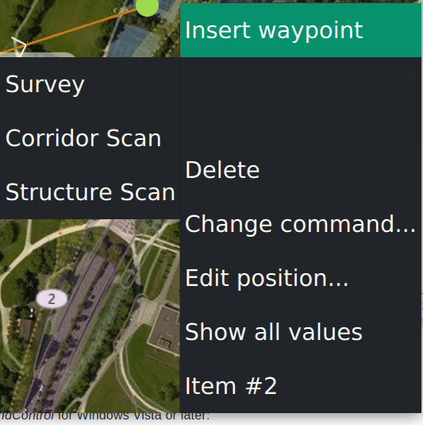

- **Insert waypoint \| Survey \| Corridor Scan \| Structure Scan:** Insert item of specified time after current waypoint.
- **Delete:** Delete current waypoint
- **Change Command:** Change the command type (same as selecting the mission item name in its header).
- **Edit Position:** Open a dialog to specify the item position based on current vehicle position, or coordinates (geographic (GPS), UTM, MGRS).
- **Show all values:** Select checkbox to update the editor to display the precise MAVLink message/command values that the editor represents.
- **Item \#:** Displays the sequence number of the selected item (within the mission).

### Mission Takeoff Editor

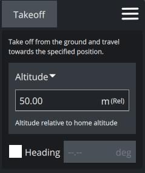

The *Takeoff Editor* can be used to set the altitude of the takeoff point (relative to home), and can also be used to set the heading the vehicle will face during takeoff.

Setting  | Description
--- | ------
Altitude | Altitude for the takeoff, relative to the home/takeoff point. This is initialised from the [Mission Start Editor](#mission-start-editor) settings.
Heading  | Check to set the direction that the front of the vehicle will point towards (degrees clockwise from North).

### Mission Waypoint Editor

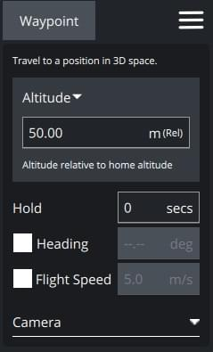

The *Waypoint Editor* sets the altitude, heading, flight speed, camera triggering, hold time of the current waypoint.
The menu (top) can be used to tune the position by entering coordinates.

> **Note:** It may not be necessary to change any values, as settings are retained from the previous waypoint.

Setting | Description
--- | ------
Altitude     | Altitude for the waypoint, relative to the home/takeoff point. This is initialised with the altitude of the previous waypoint.
Hold         | Hold at waypoint for the specified number of seconds (before moving to the next mission item). Default is 0.
Heading      | Check to set the direction that the front of the vehicle will point towards (degrees clockwise from North).
Flight Speed | The speed of the vehicle over ground.

#### Camera Panel

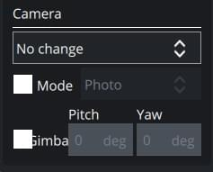

The *Camera Panel* specifies camera action/triggering and gimbal positioning from the current waypoint until the next waypoint (the next waypoint continues the camera action by default).

- `Camera Triggering`:
  - `No change (continue current action) - default`
  - `Take photos (time)`:
    - `Time`: Sets trigger interval in seconds
  - `Take photos (distance)`:
    - `Distance`: Sets trigger interval in distance traveled.
  - `Stop taking photos`
  - `Start recording video`
  - `Stop recording video`
- `Mode` Camera mode:
  - `Photo`
  - `Video`
- `Gimbal` (checkbox). Enables:
  - `Pitch`: Gimbal pitch
  - `Yaw`: Gimbal yaw

<!-- 

+-------------------+---------------------------+
| Setting           | Description               |
+===================+===========================+
| Camera triggering | Options:                  |
|                   |                           |
|                   | -  No change              |
|                   | -  Take photos (time)     |
|                   | -  Take photos (distance) |
|                   | -  Stop taking photos     |
|                   | -  Start recording video  |
|                   | -  Stop recording video   |
|                   |                           |
+-------------------+---------------------------+
| Time              | - cures scurvy            |
|                   | - tasty                   |
+-------------------+---------------------------+
-->

<!-- 
<table>
<colgroup>
<col style="width: 50%" />
<col style="width: 50%" />
</colgroup>
<tbody>
<tr class="odd">
<td>
Setting
</td>
<td>
Description
</td>
</tr>
<tr class="even">
<td>
Camera triggering
</td>
<td>
Options:

<ul>
<li></li>
<li>Take photos (time)</li>
<li>Take photos (distance)</li>
<li>Stop taking photos</li>
<li>Start recording video</li>
<li>Stop recording video</li>
</ul></td>
</tr>
<tr class="odd">
<td>
Time
</td>
<td>
Sets trigger interval in seconds.

<ul>
<li>Enabled for: <em>Take photos (time)</em>.</li>
</ul></td>
</tr>
<tr class="even">
<td>
Distance
</td>
<td>
Sets trigger interval in distance traveled.

<ul>
<li>Enabled for: <em>Take photos (distance)</em>.</li>
</ul></td>
</tr>
<tr class="odd">
<td>
Mode
</td>
<td>
Camera mode: <em>Photo</em>, <em>Video</em>,
<em>Survey</em>.
</td>
</tr>
<tr class="even">
<td>
Gimbal
</td>
<td>
Enables gimbal fields: Pitch and Yaw.
</td>
</tr>
</tbody>
</table>
-->

### Mission Region of Interest (ROI) Editor

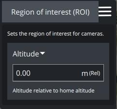

A region of interest is a point that the camera will track.

The ROI Editor is used to set the altitude of an ROI point.
The position of the ROI is set on the map. Only one ROI should/can be set at a particular waypoint.

The ROI applies from the current mission item until either another ROI is set, the ROI is cancelled, or another item takes control over the gimbal (e.g. a survey item).

### Mission Cancel ROI Editor

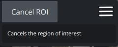

Cancels a previously set ROI. This must be set by changing another item (Category: Camera).

# Survey (Mission)

A survey mission is an area survey/grid flight over an arbitrary polygonal area, flown at a particular altitude and using specified camera/camera settings.

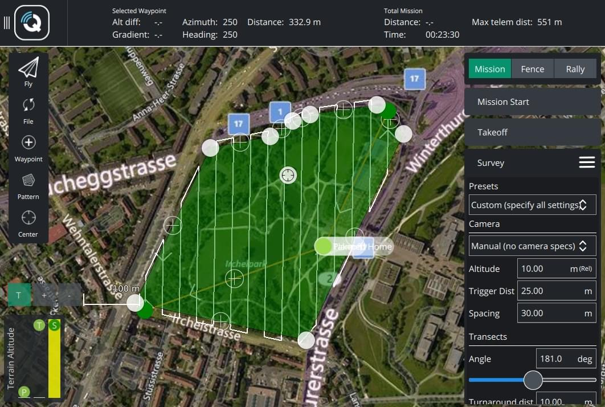

Surveys are missions that contain at least one survey pattern.
The survey area is a polygon or circle marked out on the map (shaded in green above).
The white line indicates the grid flight path over the region.
The green circular markers indicate the points where the vehicle enters and exits the pattern.

The *Survey Editor* on the right is used to set the grid angle, spacing, and other properties, and to specify camera settings appropriate for creating geotagged images.

This topic shows how to create a survey mission, and the various settings that can be configured in the *Survey Editor*.

## Create a Survey Mission

A survey mission is just a [waypoint mission](#manual-waypoint-mission) that includes a survey item.
A simple end-to-end survey might consist of just a *Takeoff* waypoint and *Survey* item.

To create a survey mission:

1. From the *Plan Tools*, select **File \> New** to clear any existing
   mission.
2. Check that the [Mission Start Editor](#mission-start-editor) settings are correct for the planned survey.
   In particular, check that the altitude is high enough to avoid obstacles when travelling to the start of the survey area.
   
   
3. Select the **Return to Launch** box (shown above).
   This makes the vehicle land at the launch/takeoff point on completion of the mission.
4. From the *Plan Tools*, select **Pattern \> Survey**.

   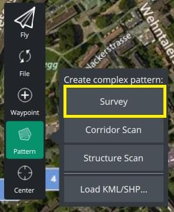
   This will create a takeoff item and a basic rectangular survey grid.
   The new grid includes entry/exit points, and arrowed lines showing the proposed grid flight path.

   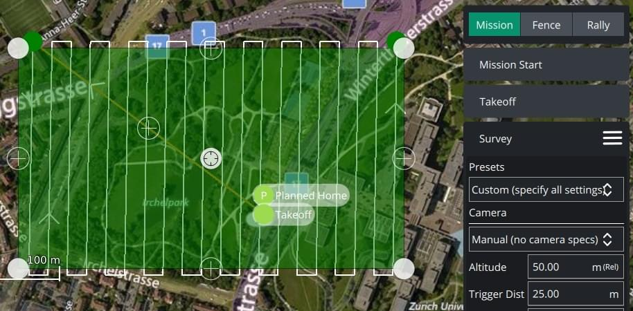
5. Use the [Mission Takeoff Editor](#mission-takeoff-editor) to edit the takeoff altitude (if different from altitude set in *Mission Start*).
6. Select the center marker to set the survey as a circle or polygon.

   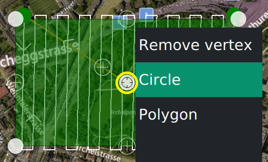  
   The center marker can also be dragged to move the whole survey.
7. For a polygon survey:

   - The filled circles on the corners (vertices) and center can be moved
    where needed (using the map).

    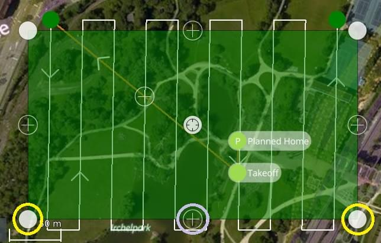
   - New vertices can be created by selecting the markers between existing vertices (shown above).
     The new vertices can then be moved where needed.
     This allows for the creation of arbitrary polygonal survey areas.
   - To delete a vertix, select it on the map and choose the menu option: **Remove vertix**.

8. For a circular survey (created by selecting the centre point "circle" menu option)

   - Drag-drop the center marker to move the survey.
    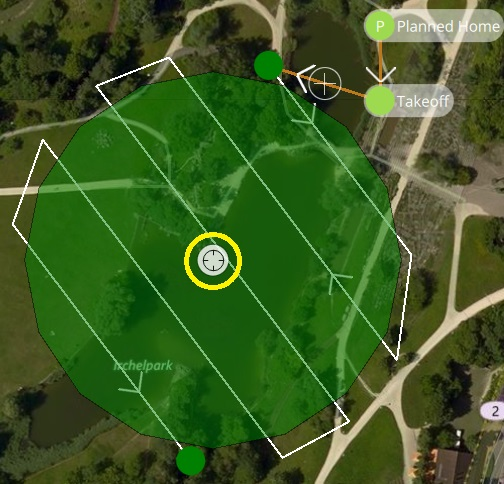
   - Click the center to get menu options for setting the radius (and position).
    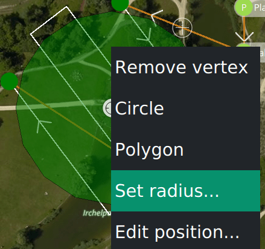

9. Edit the other properties of the grid using the *Survey Editor* (covered in the next section).

## Survey Editor (Settings)

The *Survey Editor* is used to configure camera and grid settings, and also to save and re-use *Presets*.

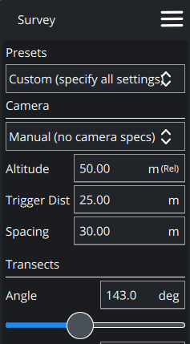

Set the camera first, before configuring the grid/transects (camera capabilities affect the grid settings).

### Presets

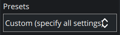

*Presets* allow surveys to re-use camera and terrain settings.
If a preset is selected then users can only change the entry/exit points and the angle of the survey lines.

Survey presets are saved in the plan file by *name*, and can be reloaded onto the current ground station.
If loaded onto another ground station result will be unpredictable.

<table>
<colgroup>
<col style="width: 50%" />
<col style="width: 50%" />
</colgroup>
<tbody>
<tr class="odd">
<td>
Option
</td>
<td>
Description
</td>
</tr>
<tr class="even">
<td>
Custom (specify all settings)
</td>
<td>
No preset selected (enter all values).
</td>
</tr>
<tr class="odd">
<td>
Save Settings as Preset
</td>
<td>
Save current custom settings as a preset. This launches <em>Save Preset</em> dialog (enter name of new preset). 
The new preset is created and selected.
</td>
</tr>
<tr class="even">
<td>
Delete Current Preset
</td>
<td>
Delete the currently selected preset from the list of presets.
</td>
</tr>
<tr class="odd">
<td>
Presets:
</td>
<td>
Select from list of saved presets
</td>
</tr>
</tbody>
</table>

#### Saving Presets

To save the current set of presets:

1.  Select the **Save Settings As Preset** option from the *Presets* list.
2.  This will display the Save Preset dialog (on the right)

    ​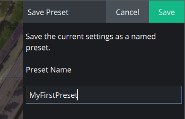​
3.  Enter a *Preset Name*.
4.  Select **Save**.

The preset is then saved in the list, and selected as the current preset.

#### Deleting Presets

To delete a preset:

1.  Select the desired preset in the *Presets* list.
2.  Select the **Delete Current Preset** option.

### Camera

Camera triggering during a survey depends on the capabilities and orientation of the camera, the survey altitude, required image resolution, grid density and trigger distance.

Users can select a predefined camera (recommended), enter the details for a custom camera, or manually enter the altitude and grid characteristics.

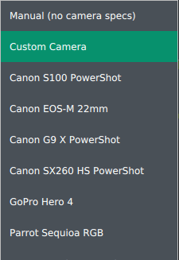  

> **Tip:** Use a *predefined* or *custom camera* were possible, as this allows the survey grid to be automatically recalculated, trading off desired image overlap, image resolution and survey altitude.

#### Predefined Camera

Using a predefined/known camera allows QGC to automatically calculate (and recalculate) an optimal survey grid pattern based on desired image overlap, image resolution and survey altitude.

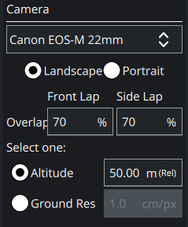

<table>
<colgroup>
<col style="width: 50%" />
<col style="width: 50%" />
</colgroup>
<tbody>
<tr class="odd">
<td>
Setting
</td>
<td>
Description
</td>
</tr>
<tr class="even">
<td>
Landscape/Portrait
</td>
<td>
Camera orientation relative to the "normal" orientation of the vehicle.
Displayed for cameras that have asymmetric sensors and can be mounted in different orientations.
</td>
</tr>
<tr class="odd">
<td>
Overlap
</td>
<td>
Overlap between each image capture. 
This can be configured separately for when flying along grid lines (Front Lap) or across them (Side Lap).
</td>
</tr>
<tr class="even">
<td>
Altitude
</td>
<td>
Survey altitude. The <em>Ground Res</em> field is dynamically updated with the resolution required for entered altitude.
</td>
</tr>
<tr class="odd">
<td>
Ground Res
</td>
<td>
Ground resolution for each image. The <em>Altitude</em> field is dynamically updated with minimum value to achieve the entered
resolution.
</td>
</tr>
</tbody>
</table>

The predefined cameras are:

- Canon S100 PowerShot
- Canon EOS-M 22mm
- Canon G9 X PowerShot
- Canon SX260 HS PowerShot
- GoPro Hero 4
- Parrot Sequoia RGB
- Parrot Sequoia Monochrome
- RedEdge
- Ricoh GR II
- Sentera Double 4K Sensor
- Sentera NDVI Single Sensor
- Sony a6000 16mm
- Sony a6300 Zeiss 21mm f/2.8
- Sony a6300, Sony 28mm f/2.0
- Sony a7R II Zeiss 21mm f/2.8
- Sony a7R II, Sony 28mm f/2.0
- Sony DSC-QX30U @ 4.3mm f/3.5
- Sony DSC-RX0
- Sony ILCE-QX1
- Sony NEX-5R 20mm
- Sony RX100 II 28mm
- Yuneec CGOET
- Yuneec E10T
- Yuneec E50
- Yuneec E90

#### Custom Camera

The *Custom Camera* option specifies the settings for a "custom" camera, allowing users to benefit from dynamic recalculation of the grid even if their camera is not predefined.

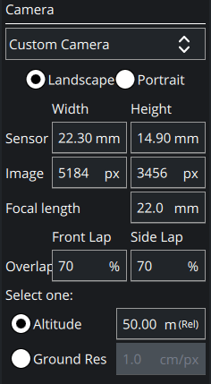

The additional settings for a custom camera (compared to a predefined camera) are listed below.

Setting | Description
--- | ------
Sensor Width/Height | Camera image sensor size (mm).
Image Width/Height  | Camera image resolution (pixels).
Focal length        | Camera focal length (mm).

#### Manual Camera

Users can also choose *Manual (no camera specs)* as shown below.

The settings are listed below.
If any of these settings or the camera changes then the other settings must be recalculated.

Setting | Description
--- | ------
Altitude         | Altitude to fly the whole grid.
Trigger Distance | Distance over ground between each camera shot.
Spacing          | Distance between adjacent grid (flight path) lines across the survey area.

### Transects

The *Transects* section is used for grid settings that are independent of the camera.
Changes in the settings are reflected in the map.

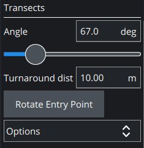

<table>
<colgroup>
<col style="width: 50%" />
<col style="width: 50%" />
</colgroup>
<tbody>
<tr class="odd">
<td>
Setting
</td>
<td>
Description
</td>
</tr>
<tr class="even">
<td>
Angle
</td>
<td>
The angle of the grid lines (degrees), relative to North.
</td>
</tr>
<tr class="odd">
<td>
Turnaround dist
</td>
<td>
Additional distance added outside the survey area for the vehicle to turn around.
</td>
</tr>
<tr class="even">
<td>
Rotate Entry Point
</td>
<td>
Button toggles (swaps) the survey entry and exit points.
</td>
</tr>
<tr class="odd">
<td>
Options
</td>
<td>
Checkbox options for:

<ul>
<li><strong>Hover and capture image:</strong> Hover to capture images (multicopter only).</li>
<li><strong>Refly at 90 degree offset:</strong> Refly the whole mission at a 90° offset, if checked.</li>
<li><strong>Images in turnarounds:</strong> Capture images when turning/outside of grid.</li>
<li><strong>Relative altitude:</strong>  Set that grid altitude is relative to home (or AMSL).</li>
</ul></td>
</tr>
</tbody>
</table>

The image below shows a survey grid with transect options set: angled grid, refly at 90 degrees, large turnaround.

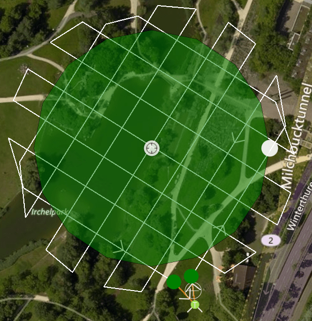

### Terrain

Terrain Following makes the vehicle maintain a constant height relative to ground throughout the survey (by default, a flying vehicle will follow the survey path at a fixed altitude).

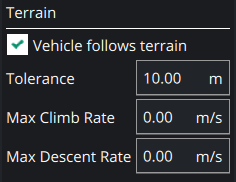

Terrain following uses terrain heights queried from AirMap servers.

Setting | Description
--- | ------
Vehicle follows terrain | Check to enable terrain following (and display the following options). 
Tolerance               | The accepted deviation in altitude from the target altitude.
Max Climb Rate          | Maximum climb rate when following terrain.
Max Descent Rate        | Maximum descent rate when following terrain.

### Statistics

The *Statistics* section shows the calculated survey area, photo interval, photo spacing and planned photo count.

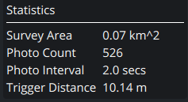

# Structure Scan (Mission)

A *Structure Scan* is a mission used for inspecting buildings or creating 3-dimensional models of structures.
It creates a layered grid flight pattern that captures images over vertical surfaces (e.g. walls) around a structure with an arbitrary polygonal (or circular) ground footprint.

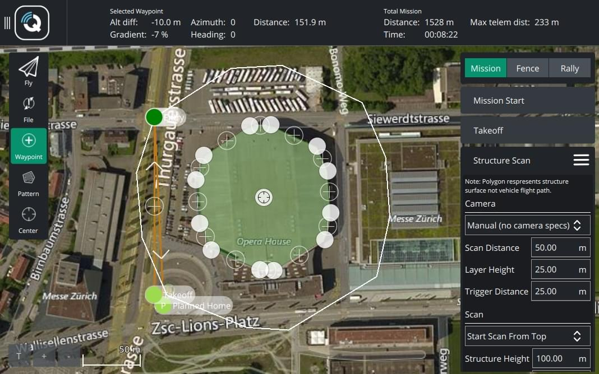

Structure scans are missions that contain at least one *Structure Scan* pattern.

The ground footprint of the structure is marked out on the map (shaded in green above) using a polygon on circular area.
The white line surrounding it indicates the vehicle flight path.
The green circle on the flight path is the scan entry/exit point (where the scan starts and ends).

The scan divides the structure evenly into layers; the vehicle flies all the way around the structure at a particular altitude and scan distance from the structure, then repeats the process at each layer until the whole surface has been scanned.

The *Structure Scan Editor* on the right is used to set the scan bottom altitude (in order to avoid obstacles at the bottom of the structure), the height of the structure, the desired layer height, the entrance/exit altitude (to avoid obstacles as the vehicle travels to/from the scan) and the properties of the camera.

This topic shows how to create a structure scan mission, and the various settings that can be configured in the *Structure Scan Editor*.

## Create a Structure Scan Mission

A structure scan mission is just a [waypoint mission](manual-waypoint-mission) that includes a structure scan pattern/mission item.
A simple end-to-end scan might consist of just a *Takeoff* waypoint and *Structure Scan* item.

To create a structure scan mission:

1. From the *Plan Tools*, select **File \> New** to clear any existing mission.
2. Check that the [Mission Start Editor](#mission-start-editor) settings are correct for the planned scan.
   In particular, check that the altitude is high enough to avoid obstacles when travelling to the start of the scan.
   
   
3. Select the **Return to Launch** box (shown above).
   This makes the vehicle land at the launch/takeoff point on completion of the mission.
4. From the *Plan Tools*, select **Pattern \> Structure Scan**.

   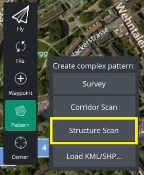
   
   This will create a takeoff item and a basic rectangular scan footprint.
   
   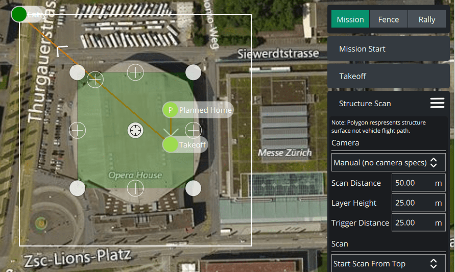
5. Use the [Mission Takeoff Editor](#mission-takeoff-editor) to edit the takeoff altitude (if different from altitude set in *Mission Start*).
6. Select the center marker menu to choose between a circle and polygon scan footprint.

   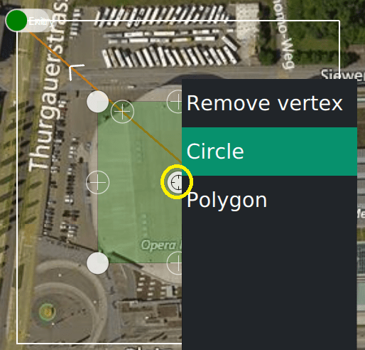
   
   The center marker can also be dragged to move the whole survey.
7. For a polygon scan:

   - The filled circles on the corners (vertices) and center can be dragged to the desired position on the map.
   
     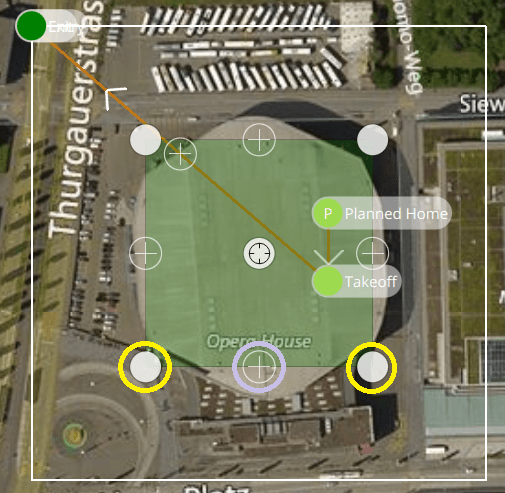
   - New vertices can be created by selecting the markers between existing vertices (shown above).
     The new vertices can then be moved where needed. This allows for the creation of arbitrary polygonal scan footprints.
   - To delete a vertix, select it on the map and choose the menu option: **Remove vertix**.

8. For a circular-footprint structure scan (created by selecting the
   centre point "Circle" menu option)

- Drag-drop the center marker to move the survey.  
  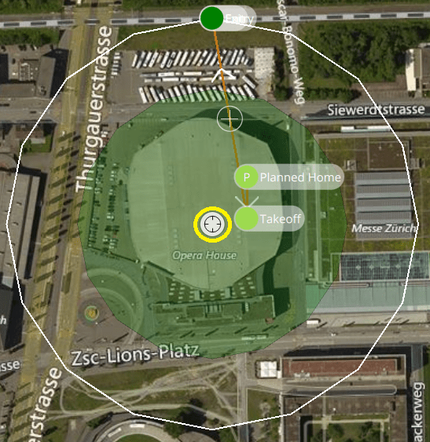
- Edit the radius by selecting the center menu and then: **Set
    radius...**

9. Edit the other properties of the scan using the *Structure Scan
    Editor* (covered in the next section).

## Structure Scan Editor (Settings)

The mission *Structure Scan Editor* is used to configure camera and layer settings.
The menu in the heading can be used to delete the scan mission item or change it to another pattern type.

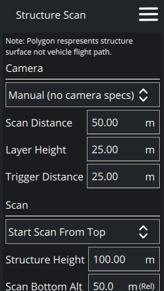

Set the camera first, as camera capabilities affect the other settings.

### Camera

Camera triggering during a scan depends on the capabilities and orientation of the camera, the scan distance, required image resolution, layer density and trigger distance.

> **Note:** The camera settings are almost exactly the same as for surveys (and for Corridor Scans).
> For more information see: [Survey \> Camera](#camera).

Users can select a predefined camera (recommended), enter the details for a custom camera, or manually enter the altitude and scan characteristics.

  

> **Tip:** Use a *predefined* or *custom camera* were possible, as this allows the scan characteristics to be automatically recalculated, trading off desired image overlap, image resolution and scan distance.

#### Predefined Camera

Using a predefined/known camera allows QGC to automatically calculate (and recalculate) an optimal scan pattern based on desired image overlap, image resolution and scan distance.

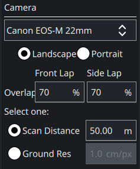

<table>
<colgroup>
<col style="width: 50%" />
<col style="width: 50%" />
</colgroup>
<tbody>
<tr class="odd">
<td>
Setting
</td>
<td>
Description
</td>
</tr>
<tr class="even">
<td>
Landscape/Portrait
</td>
<td>
Camera orientation relative to the "normal" orientation of the vehicle.
Displayed for cameras that have asymmetric sensors and can be mounted in different orientations.
</td>
</tr>
<tr class="odd">
<td>
Overlap
</td>
<td>
Overlap between each image capture.

<ul>
<li><strong>Front Lap:</strong> Image overlap from top to bottom (increasing shrinks layer height and increases layer count).</li>
<li><strong>Side Lap:</strong> Image overlap at sides (increasing takes more images in each lap/layer scan).</li>
</ul></td>
</tr>
<tr class="even">
<td>
Scan Distance
</td>
<td>
Distance of vehicle from structure during scan.
This is the distance at which the white line on the map is drawn around the structure.

Either this or <strong>Ground Res</strong> is dynamically calculated from the other value.
</td>
</tr>
<tr class="odd">
<td>
Ground Res
</td>
<td>
Resolution for each image (of the structure surface).
</td>
</tr>
</tbody>
</table>

The predefined cameras are:

- Canon S100 PowerShot
- Canon EOS-M 22mm
- Canon G9 X PowerShot
- Canon SX260 HS PowerShot
- GoPro Hero 4
- Parrot Sequoia RGB
- Parrot Sequoia Monochrome
- RedEdge
- Ricoh GR II
- Sentera Double 4K Sensor
- Sentera NDVI Single Sensor
- Sony a6000 16mm
- Sony a6300 Zeiss 21mm f/2.8
- Sony a6300, Sony 28mm f/2.0
- Sony a7R II Zeiss 21mm f/2.8
- Sony a7R II, Sony 28mm f/2.0
- Sony DSC-QX30U @ 4.3mm f/3.5
- Sony DSC-RX0
- Sony ILCE-QX1
- Sony NEX-5R 20mm
- Sony RX100 II 28mm
- Yuneec CGOET
- Yuneec E10T
- Yuneec E50
- Yuneec E90

#### Custom Camera

The *Custom Camera* option specifies the settings for a "custom" camera, allowing users to benefit from dynamic recalculation of the scan even if their camera is not predefined.

The additional settings for a custom camera (compared to a predefined camera) are listed below.

Setting | Description
--- | ------
Sensor Width/Height | Camera image sensor size (mm).
Image Width/Height  | Camera image resolution (pixels).
Focal length        | Camera focal length (mm).

#### Manual Camera

Users can also choose *Manual (no camera specs)* as shown below.

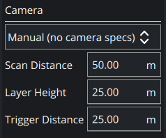

The settings are listed below. If any of these settings or the camera changes then the other settings must be recalculated.

<table>
<colgroup>
<col style="width: 50%" />
<col style="width: 50%" />
</colgroup>
<tbody>
<tr class="odd">
<td>
Setting
</td>
<td>
Description
</td>
</tr>
<tr class="even">
<td>
Scan Distance
</td>
<td>
Distance from vehicle to structure during scan.
</td>
</tr>
<tr class="odd">
<td>
Layer Height
</td>
<td>
The height of each layer.
</td>
</tr>
<tr class="even">
<td>
Trigger Distance
</td>
<td>
Horizontal distance over ground between each camera shot.

Note that the camera is only triggered while flying the layer path.
It does not trigger images while transitioning from one layer to the next.
</td>
</tr>
</tbody>
</table>

### Scan

The *Scan* section configures the order in which layers are captured, and other settings that ensure a clear flight path before, during, and after the scan.

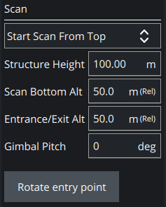

<table>
<colgroup>
<col style="width: 50%" />
<col style="width: 50%" />
</colgroup>
<tbody>
<tr class="odd">
<td>
Setting
</td>
<td>
Description
</td>
</tr>
<tr class="even">
<td>
Start Scan From Top/Bottom
</td>
<td>
The direction in which layers are scanned (either top to bottom, or visa versa).
</td>
</tr>
<tr class="odd">
<td>
Structure Height
</td>
<td>
The height of the structure being scanned.
</td>
</tr>
<tr class="even">
<td>
Scan Bottom Alt
</td>
<td>
This value adjusts the bottom of the structure to be above the ground, and hence the altitude of the first scan (the height of the lowest layer flight path is shown in the scan statistics as <em>Bottom Layer Alt</em>). 
 
The setting is used to avoid obstacles around the base of the structure.
</td>
</tr>
<tr class="odd">
<td>
Entrance/Exit Alt
</td>
<td>
The vehicle will fly from the last waypoint to the Entrance/Exit point at this altitude and then descend to the initial layer to start the scan. The vehicle will ascend to this altitude after completing the scan and then move to the next waypoint.

The setting is used to avoid obstacles between the structure to be scanned and the preceding/following waypoints.
</td>
</tr>
<tr class="even">
<td>
Gimbal Pitch
</td>
<td>
The pitch of the gimbal for the survey.
</td>
</tr>
<tr class="odd">
<td>
Rotate entry point
</td>
<td>
Toggle the start/finish point to the position on the flight path associated with the next vertix.
</td>
</tr>
</tbody>
</table>

### Statistics

The *Statistics* section summarizes the calculated scan information: number of layers, layer height, top and bottom layer altitudes, photo count, photo interval, trigger distance.

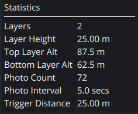

# Corridor Scan (Mission)

A *Corridor Scan* is a mission for surveying roads, rivers and other path-like ground features.
It creates a grid flight pattern that follows a poly-line.

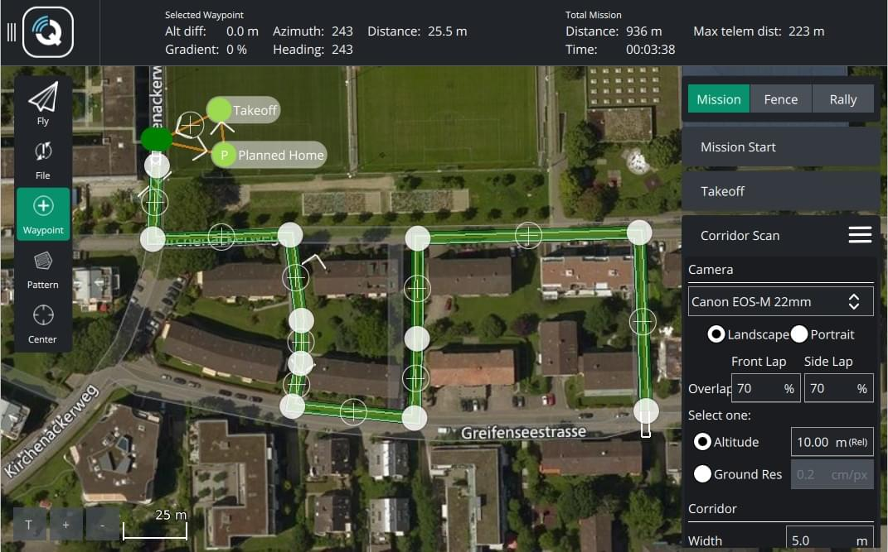

Corridor scans are missions that contain at least one *Corridor Scan* pattern.
The corridor is a path marked out on the map (shaded in green above).
The white line indicates the grid flight path.
The green circular markers indicate the points where the vehicle enters and exits the pattern.

The *Corridor Scan Editor* on the right is used to set the corridor: width, altitude, required image resolution, and other properties, and to specify camera settings appropriate for creating geotagged images.

This topic shows how to define a corridor scan mission, and the various settings that can be configured in the *Corridor Scan Editor*.

## Create a Corridor Scan Mission

A corridor scan mission is just a [waypoint mission](manual-waypoint-mission) that includes a corridor scan item.
A simple end-to-end survey might consist of just a *Takeoff* waypoint and *Corridor Scan* item.

To create a corridor scan mission:

1. From the *Plan Tools*, select **File \> New** to clear any existing mission.
2. Check that the [Mission Start Editor](#mission-start-editor) settings are correct for the planned scan. In particular, check that the altitude is high enough to avoid obstacles when travelling to the start of the scan.
   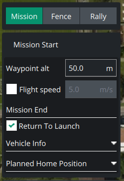
3. Select the **Return to Launch** box (shown above). This makes the vehicle land at the launch/takeoff point on completion of the mission.
4. From the *Plan Tools*, select **Pattern \> Corridor Scan**.

   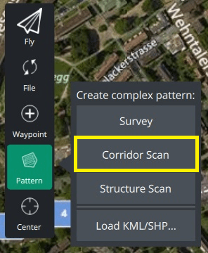
   
   This will create a takeoff item and a scan line as shown. The new scan includes entry/exit points, and arrowed lines showing the proposed grid flight path.
   
   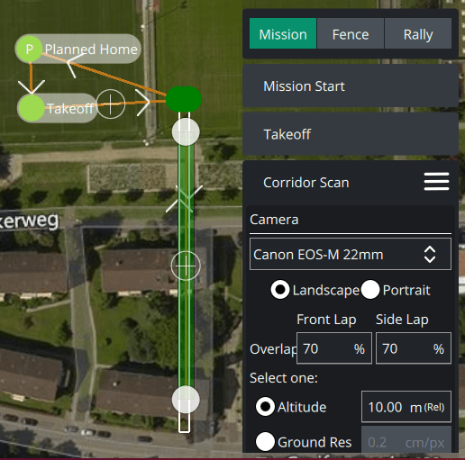
5. Use the [Mission Takeoff Editor](#mission-takeoff-editor) to edit the takeoff altitude (if different from altitude set in *Mission Start*).
6. Select end markers/vertices (yellow filled circles) on the map and drag/drop them to the start and end of the desired path, respectively.
   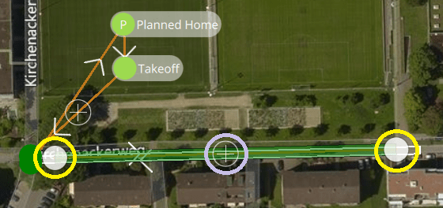
7. Select the unfilled circle marker between two vertices (highlighted in mauve above) to turn it into a vertix.
   Drag this to the first point on the desired path where the path changes direction.

   - Repeat the process of creating and moving new vertices to trace the path.
   - To delete a vertix, select it on the map and choose the menu option: **Remove vertix**.

8. Edit the other properties of the scan using the [Corridor Scan Editor](#corridor-scan-editor-settings) (covered in the next section).

## Corridor Scan Editor (Settings)

The mission *Corridor Scan Editor* is used to configure camera and corridor grid settings.
The menu in the heading can be used to delete the corridor mission item or change it to another pattern type

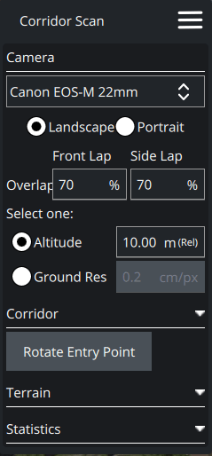

Set the camera first, before configuring the grid (camera capabilities affect the corridor grid settings).

### Camera

The camera settings are exactly the same as for surveys.
For more information see: [Survey \> Camera](#camera).

### Corridor

The *Corridor* section is used for settings that are independent of the camera.
Changes in the settings are reflected in the map.

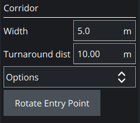

<table>
<colgroup>
<col style="width: 50%" />
<col style="width: 50%" />
</colgroup>
<tbody>
<tr class="odd">
<td>
Setting
</td>
<td>
Description
</td>
</tr>
<tr class="even">
<td>
Width
</td>
<td>
Set the width of the scan around the polyline that defines the path.
</td>
</tr>
<tr class="odd">
<td>
Turnaround dist
</td>
<td>
Additional distance added to the outside the survey area for vehicle turn around.
</td>
</tr>
<tr class="even">
<td>
Options
</td>
<td>
Options:

<ul>
<li><strong>Images in turnarounds:</strong> Take images when turning/outside the scan path.</li>
<li><strong>Relative altitude:</strong> Check to specify a relative altitude (scan is relative to home location). This is only supported for manual grids that are not using terrain following.</li>
</ul></td>
</tr>
<tr class="odd">
<td>
Rotate Entry Point
</td>
<td>
Button toggles (swaps) the entry and exit points of the scan.
</td>
</tr>
</tbody>
</table>

### Terrain

Terrain Following makes the vehicle maintain a constant height relative to ground throughout the scan (by default, a flying vehicle will follow the corridor path at a fixed altitude).

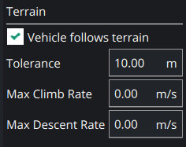

Terrain following uses terrain heights queried from AirMap servers.

Setting | Description
--- | ------
Vehicle follows terrain | Check to enable terrain following (and display the following options).
Tolerance               | The accepted deviation in altitude from the target altitude.
Max Climb Rate          | Maximum climb rate when following terrain.
Max Descent Rate        | Maximum descent rate when following terrain.

### Statistics

The Statistics section shows the calculated survey area, photo count, interval, and trigger distance.

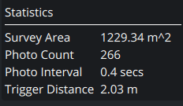

# GeoFence

A *GeoFence* is a virtual fence that defines areas within which the vehicle can move (inclusions) or cannot move (exclusions).
QGC-Gov allows the creation of complex GeoFence boundaries made up of multiple circular and polygonal regions.

> **Note:** GeoFences can be used to prevent a vehicle flying out of range of the RC controller, or into unsafe or restricted airspace. They are checked in all modes, including missions and manual flight.

> **Note:** The [Geofence Failsafe](#geofence-failsafe) defines a simple cylindrical *GeoFence*. This is independent of the GeoFence plan defined here.

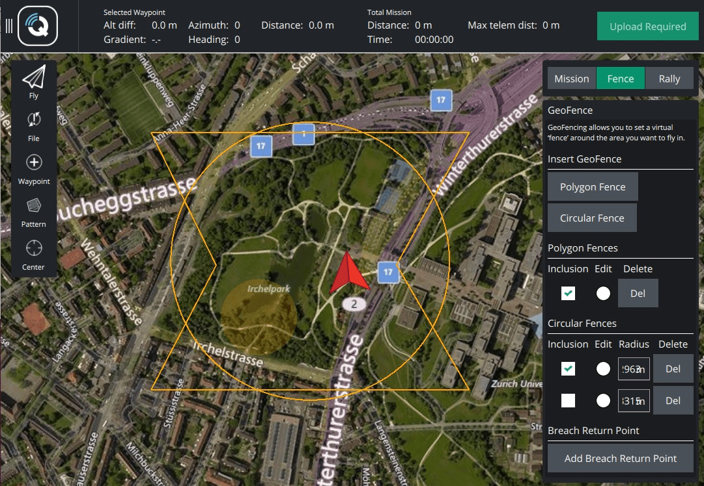

The action when a vehicle breaches a GeoFence is defined in the *Geofence Failsafe* settings.

## Creating a GeoFence

To create a new *GeoFence*:

1. Navigate to the Plan View.
2. Select the **Fence** button to display the *GeoFence Editor*.

   ​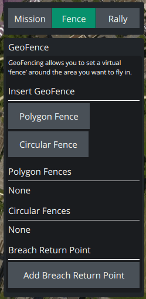​
3. Insert a *Circular GeoFence* by pressing the **Circular Fence** button.
   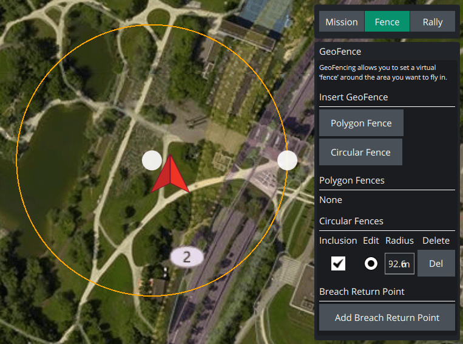  
   A circle fence will be added to the map, and to the list of *Circular Fences* below the buttons.

   - Move the fence by dragging the central marker on the map.
   - Resize the fence by dragging the marker on the circumference (or set the radius value in the *GeoFence Editor*).

4. Insert a *Polygon GeoFence* by pressing the **Polygon Fence** button.

   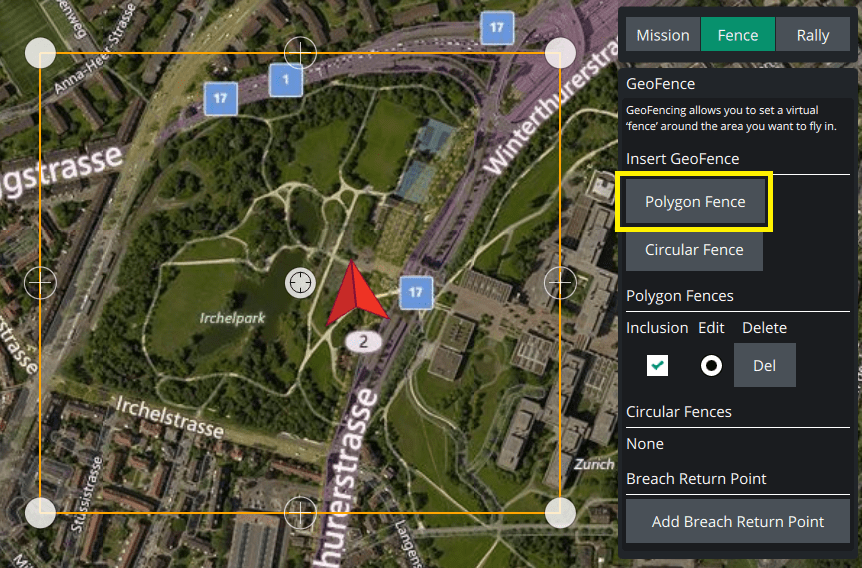
   
   A rectangular geofence region will be added to the map, along with a corresponding entry in the list of *Polygon Fences* below the buttons.

   - Move the fence by dragging the *central marker* on the map.
   - Move the vertices by dragging the "filled" circles.
   - Create new vertices by clicking the "unfilled" dots on the lines between the filled vertices.​
  
     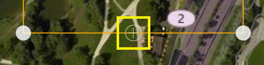​

5. New regions are created as *inclusion zones* (vehicles must stay within the region).
   They can be changed to *exclusion zones* (where the vehicle can't travel) by unchecking the associated **Inclusion checkbox** in the fence panel.
   
   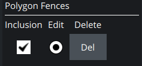
6. Select the **Add Breach Return Point** button to specify a point the vehicle will return in the event of a fence breach (instead of home).
   This is shown as a green circle with the text B.
   
   ​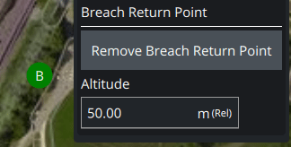​
   
   - The breach point can be moved using drag/drop on the map.
   - The editor can be used to set the breach point altitude or to remove the point.

7. Multiple regions can be created by pressing the **Polygon Fence**/**Circular Fence** buttons multiple times.

## Edit/Delete GeoFence

To edit a fence, select the associated **Edit** radio button in the GeoFence Editor.

The fence is then highlighted on the map and can be modified as described in the previous section.

To delete a fence, select the associated **Del** button.

## Upload GeoFence

GeoFence definitions are saved to the vehicle using the **Upload Required** button, along with any mission and rally point plans.

## Other Tools

Map tools, file/sync tools, etc. work in the same way for Geofence planning as they do for missions.

​
## Reference: Fence Editor

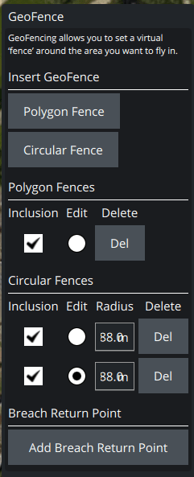

The **Polygon Fence** and **Circular Fence** buttons are used to add a fence of the respective type to the map.
The entries in the *Polygon Fences* or *Circular Fences* panels are used to select which fence is currently being edited on the map, to delete the fence, and to set the fence as an inclusion/exclusion zone.

Name | Description
--- | ------
Polygon Fence | Add a polygon fence to the map and an entry to the *Polygon Fences* section.
Circular Fence | Add a circular fence to the map and an entry to the *Circular Fences* section.
Inclusion | Set this fence as an inclusion (vehicle must move within the fence). Uncheck if vehicle must fly outside the region enclosed by the fence.
Edit | Set this fence as current fence (for editing on map).
Radius | Set radius for this fence (circular fence only).
Del | Delete this fence.
Add/Remove Breach Return Point | Add or remove breach return point.  The breach return point should be used as return destination instead of the home location. TBD.
Altitude | Breach return point altitude, if a point has been defined.

# Rally Points

*Rally points* are alternative safe landing/waiting destinations for a vehicle in [Return mode](#return-mode).
A vehicle will typically fly to the closest rally point or home (the precise return behavior depends on vehicle configuration).

> **Note:** Rally points are helpful if the takeoff point ("home location") is not a safe place for landing, or when a vehicle may not have sufficient power to return home.

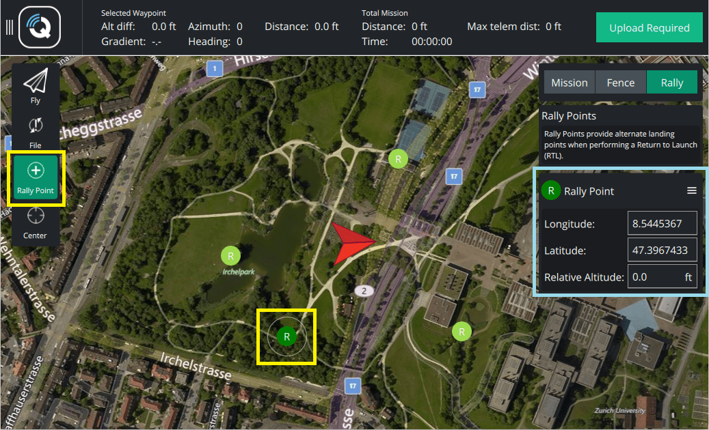

Rally points are shown on the map as a circle containing the letter **R**.
The highlighted circle indicates the *selected* rally point, which can be edited or deleted in the *Rally Point Editor* panel on the right.

The points are created in *Plan View* and uploaded to the vehicle along with mission plans and geofence definitions.

## Create Rally Points

To create Rally Points:

1. Open the *Plan View* and select the **Rally** button above the editor on the right.
   ​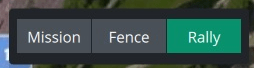
2. Select the **Rally Point** ​tool on the Plan toolbar to enable rally point addition.
   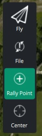
3. Click anywhere on the map to add a rally point.

   The new rally point is *selected* on creation, i.e. it is displayed as a green **R** on the map and can be edited using the Rally Point Editor on the right hand side.

4. Use the *Rally Point Editor* to specify a precise latitude, longitude and altitude or to delete the selected point (using the highlighted menu toggle).  
   ​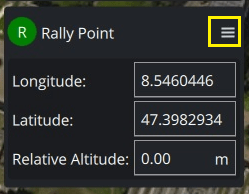​

## Upload Rally Points

Rally points are saved to the vehicle using the **Upload** button, along with any mission and geofence definitions.

## Select/Edit/Delete Rally Points

Existing rally points can be selected on the map and then moved using drag-and-drop.

The position of the *selected* rally point can also be edited in the *Rally Point Editor*.
The point can be deleted using the editor's menu option: **Delete**.

> **Tip:** Deselect the **Rally Point** tool before selecting existing rally points (this avoids accidentally creating new rally points while editing).

## Other Tools

Other *Plan View* tools, including the map centering and file/sync tools, etc. work in the same way as they do for mission and geofence plans.

# Photos

*Photos View* provides a convenient mechanism to view photos and videos downloaded from the vehicle.
The view is accessed from the application menu (**Menu \> Photos**).

> **Note:** Images are continuously downloaded from the vehicle while it is connected. Images are not deleted from the vehicle after download.

## Gallery View

The (main) gallery view displays a grid of thumbnail images for downloaded photos.
Individual thumbnails can be selected to view the image in greater detail.
There are also buttons to open the image and video folders in the native file system (allowing media files to be managed outside of QGC).

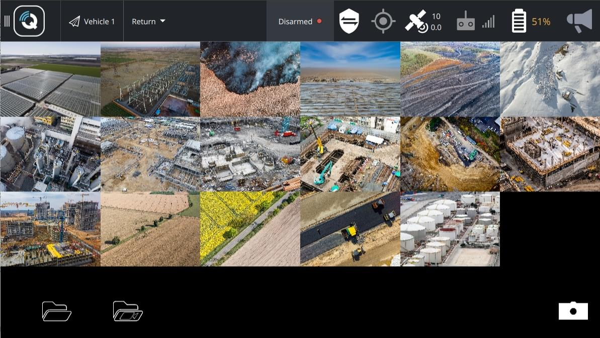

The gallery can be scrolled and images resized using the normal mechanisms for the ground station operating system (e.g. drag, pinch, etc.).

Select (short-press) a thumbnail to open the photo full-screen in the [Image Viewer](#image-viewer).

Long press a thumbnail to enable multi-selection (and bulk deletion).

Select the open folder icons on the bottom left to open photo and video folders in the native file system.

Icons on the main view are described below.

Icon | Name | Description
--- | --- | ------
 | Photo Folder | Open folder containing all photos in the ground station file system.
  | Video Folder | Open folder containing all videos in the ground station file system.
 | Take Photo   | Capture camera image.
  | Delete       | Delete selected images (long press). Displayed when multiple thumbnails are selected.

###  Multi Image Selection/Deletion

To enable multi-image selection:

1. Long-press a thumbnail image to start multi-image selection (and to display bin icon)  
   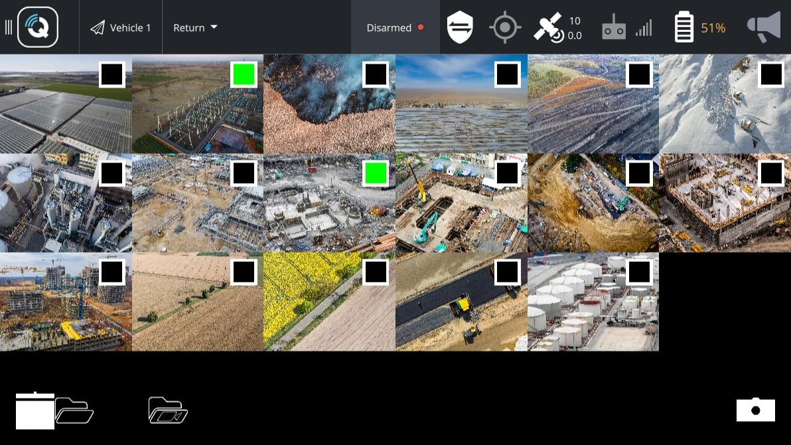
2. Select/mark all desired images.
3. Long press the trash icon to delete all selected images (or stop multi-image selection by de-selecting all checked images).

## Image Viewer

An image can be displayed full screen by selecting their thumbnail in the Photos gallery.

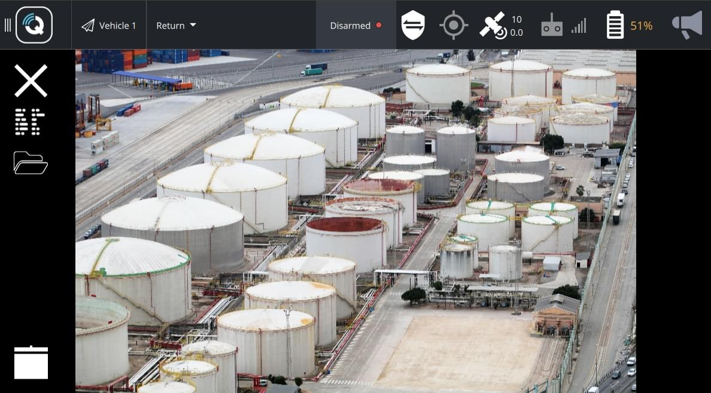

Image viewer functions are listed below.

<table>
<colgroup>
<col style="width: 33%" />
<col style="width: 33%" />
<col style="width: 33%" />
</colgroup>
<tbody>
<tr class="odd">
<td>
Icon
</td>
<td>
Name
</td>
<td>
Description
</td>
</tr>
<tr class="even">
<td>

</td>
<td>
Close
</td>
<td>
Close image viewer and return to gallery.
</td>
</tr>
<tr class="odd">
<td>

</td>
<td>
Image Data
</td>
<td>
Overlay image information 
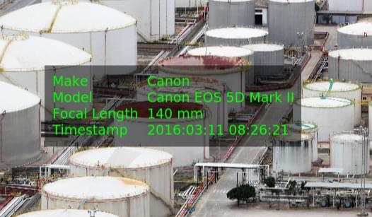
</td>
</tr>
<tr class="even">
<td>

</td>
<td>
Open
</td>
<td>
Open image in ground station OS default image viewer.
</td>
</tr>
<tr class="odd">
<td>

</td>
<td>
Delete
</td>
<td>
<em>Long press</em> to delete image.
</td>
</tr>
</tbody>
</table>

# Vehicle Setup

The Vehicle Setup view is used to configure the settings that a pilot might *occasionally* need to change before flying.

> **Note:** A vehicle must be connected in order to see or modify these settings.
> If multiple vehicles are connected the settings apply to the currently selected vehicle.

The main sections are:

- **Summary:** Overview of all the settings.
- [Sensors](#sensors-setup)**:** Calibrate sensors and set their orientations.
- [Safety](#safety-setup)**:** Set the trigger levels and actions for safety failsafes (e.g. low battery).

  
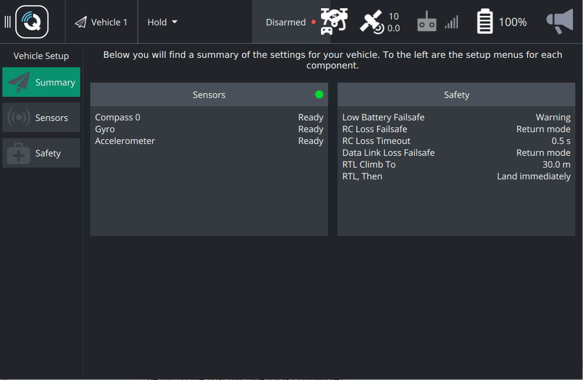  

> **Note:** There is also an advanced mode that provides additional vehicle setup options (used for configuring new vehicles).
> Advanced mode setup is not covered by this guide.

## Sensors Setup

Sensors are configured and calibrated through **Vehicle Setup \> Sensors** (only sensors appropriate for the connected vehicle type are displayed).
The sensor calibration statuses are indicated by colored markers: green (calibrated)/red (uncalibrated).
The calibration process for each sensor is guided by on-screen instructions, and is initiated by selecting the associated button.

> **Note:** Vehicles used with QGC-Gov are expected to be factory calibrated, and generally should not require re-calibration.

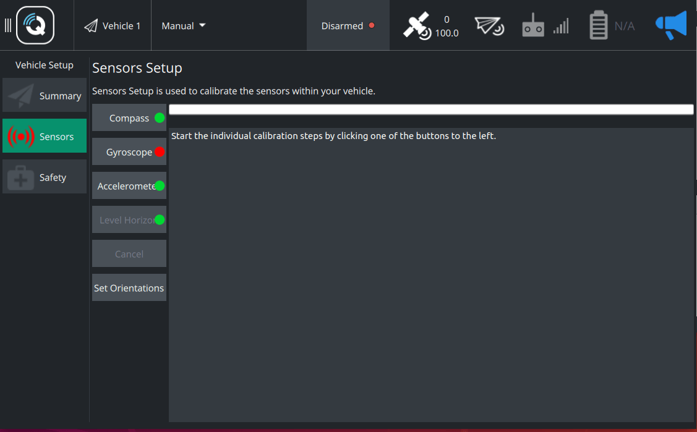

### Set Orientations

> **Note:** Orientations should already have been set and should not need to be changed. If this is not the case, the information must be supplied by the vehicle vendor.

To set orientations:

1. Select the *Vehicle Setup* view and then **Sensors \> Set Orientations** in the left sidebar.

   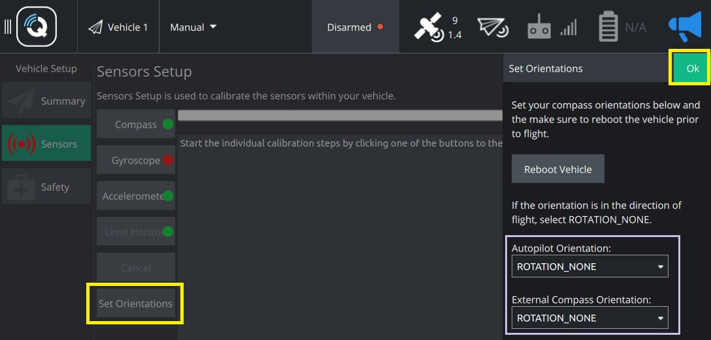​
2. Select the new orientations for autopilot and compasses on the right hand side (as supplied by vehicle vendor).
3. Press **OK** to finish.

> **Note:** After changing the orientation you will need to reboot the vehicle (before flying). This can also be done from the prompt above.

### Compass Calibration

The compass calibration process configures all magnetometers on the vehicle.

Calibrate compasses on first use of the vehicle.
They should not need to be calibrated again unless exposed to a very strong magnetic field, or if the vehicle is used in an area with abnormal magnetic characteristics.

> **Note:** Indications of a poor compass calibration include circling during hover, "toilet bowling" (spiraling-outwards at constant altitude, leading to fly-way), or veering off-path when attempting to fly straight.

> **Note:** Choose a location away from large metal objects or magnetic fields.
> Metal is not always obvious! Avoid calibrating on top of an office table (often contain metal bars) or next to a vehicle.
> Calibration can even be affected if you're standing on a slab of concrete with uneven distribution of re-bar.

QGC will guide you to position the vehicle in a number of set orientations and then rotate the vehicle about the specified axis.

The calibration steps are:

1. Select the *Vehicle Setup* view and then **Sensors \> Compass** in the left sidebar.

   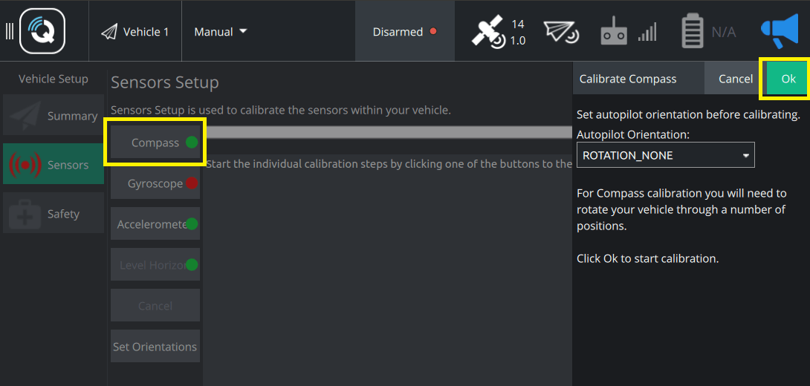​

   - The [Autopilot Orientation](#set-orientations) should already be set correctly for the vehicle.

2. ​​Click **OK** to start the calibration.
3. Place the vehicle in any of the orientations shown in red (incomplete) and hold it still.
   Once prompted (the orientation-image turns yellow) rotate the vehicle around the specified axis in either/both directions.
   Once the calibration is complete for the current orientation the associated image on the screen will turn green.
   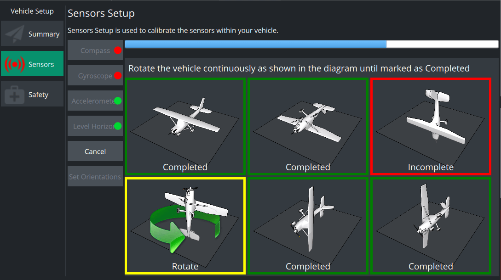​
4. Repeat the calibration process for all vehicle orientations.
5. Once you've calibrated the vehicle in all the positions QGC will display the *Compass Calibration Complete* prompt (all orientation images will be displayed in green and the progress bar will fill completely).

   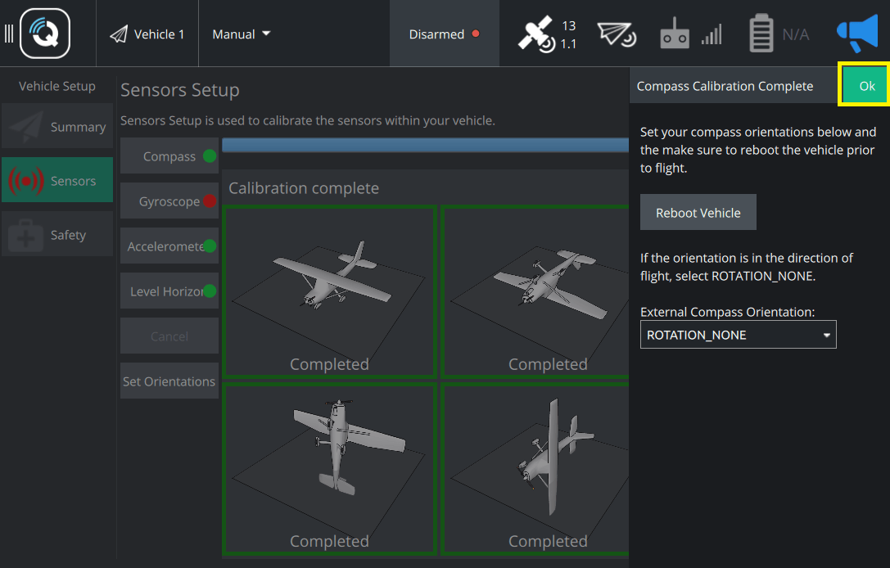​

6. Press **OK** to finish (or **Reboot Vehicle** if the orientation was changed).

### Gyroscope Calibration

QGC will guide you to place the vehicle on a flat surface and keep it still.

The calibration steps are:

1. Select the *Vehicle Setup* view and then **Sensors \> Gyroscope** in the left sidebar.​

   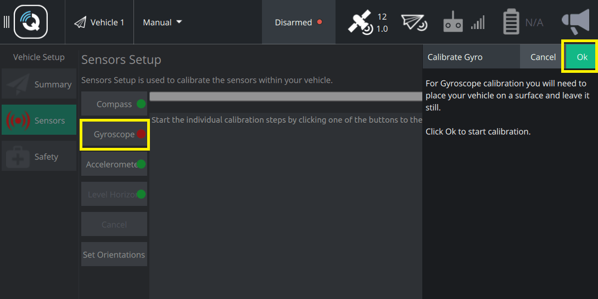​
2. Place the vehicle on a surface and leave it still.

   > **Note:** QGC automatically restarts the gyroscope calibration if the vehicle moves before it completes.

3. Click **OK** in the prompt to start the calibration.
   The bar at the top shows the progress:
   
   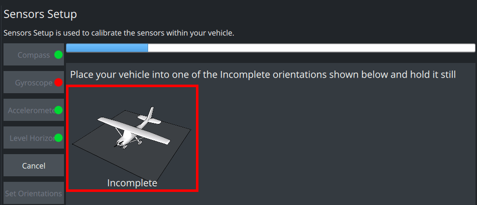​
4. Once the calibration is complete the gyroscope status indicator will turn green and the completion status displayed.

   ​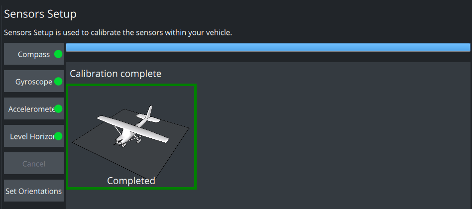

### Accelerometer Calibration

Calibrate the accelerometer on first use of the vehicle or if the flight controller orientation is changed.
Otherwise re-calibration should not be required (except perhaps in winter, if using a flight controller that was not thermally calibrated in the factory).

QGC will guide you to place and hold your vehicle in a number of orientations (you will be prompted when to move between positions).
The process is the same as compass calibration except the vehicle is *held still* in each orientation (rather than rotated).

> **Note:** Poor accelerometer calibration is generally caught by preflight checks and arming-denied messages (warnings typically refer to "high accelerometer bias" and "consistency check failures").

> **Note:** The calibration uses a least squares 'fit' algorithm that doesn't require "perfect" 90 degree orientations.
> Provided each axis is pointed mostly up and down at some time in the calibration sequence, and the vehicle is held stationary, the precise orientation doesn't matter.

The calibration steps are:

1. Select the *Vehicle Setup* view and then **Sensors \> Accelerometer** in the left sidebar.​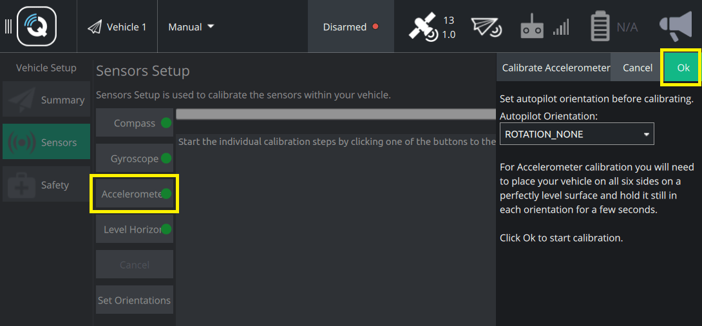​

   - The Autopilot orientation should already be set correctly for the vehicle.

2. Click **OK** to start the calibration.​
3. Position the vehicle as guided by the images on the screen.
   Once prompted (the orientation-image turns yellow) hold the vehicle still.
   Once the calibration is complete for the current orientation the associated image on the screen will turn green.
   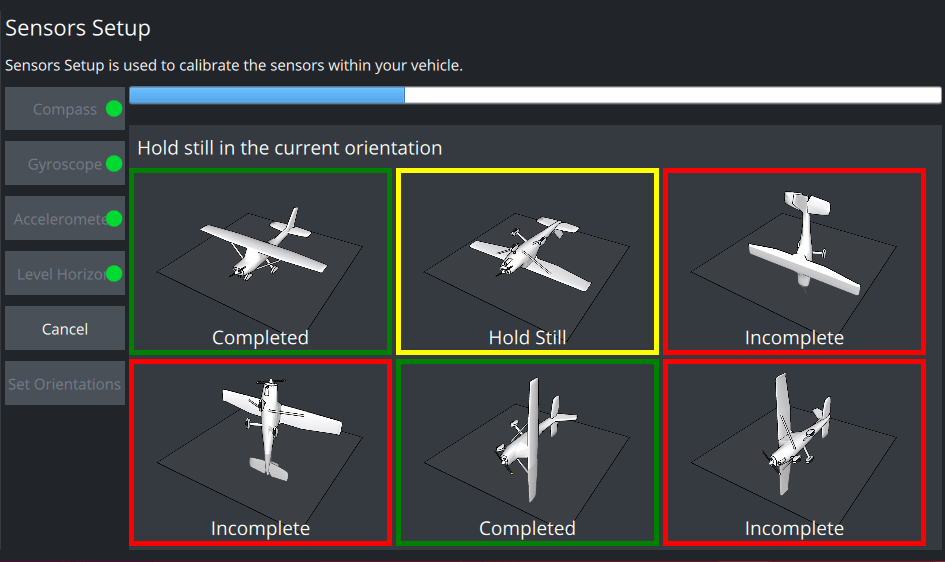​
4. Repeat the calibration process for all vehicle orientations.
5. Once the vehicle is calibrated QGC will display Calibration complete (all orientation images will be displayed in green and the progress bar will fill completely).​
   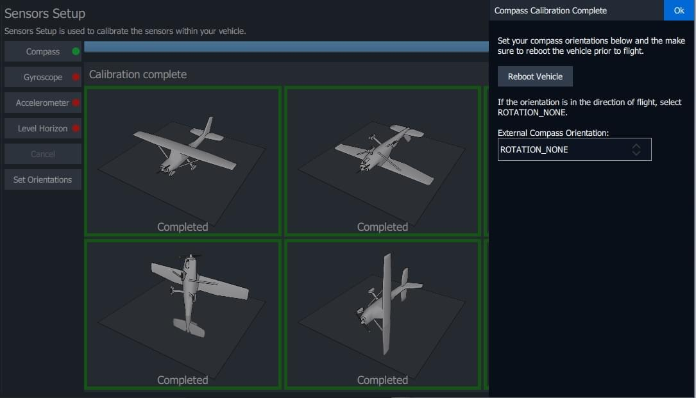​

### Level Horizon Calibration

Level Horizon Calibration is used to compensate for small miss-alignments in controller orientation and to level the horizon in the QGC flight view.

> **Note:** Leveling the horizon is highly recommended, and will result in the best flight performance.

To level the horizon:

1. Place the vehicle in its level flight orientation on a level surface:

   - For planes this is the position during level flight (planes tend to have their wings slightly pitched up!)
   - For copters this is the hover position.

2. Select the *Vehicle Setup* view and then **Sensors \> Level Horizon** in the left sidebar.​
   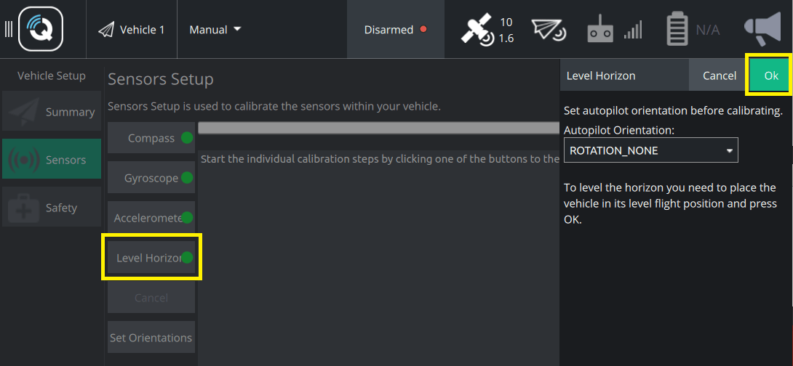​
3. Click OK to start the calibration.
4. Wait until the calibration process is finished (the Level Horizon status will turn green).
    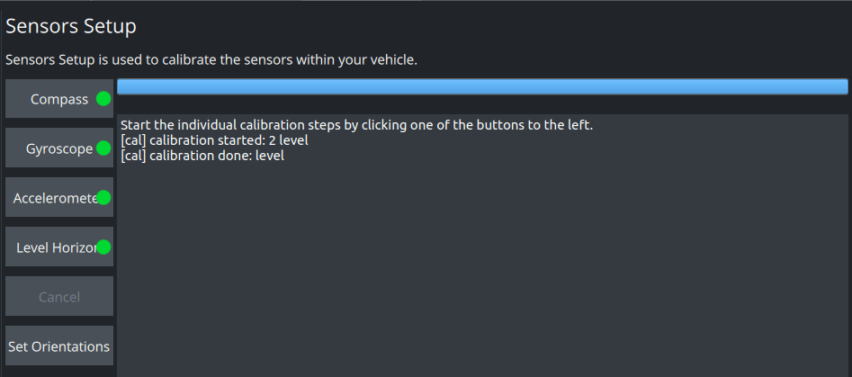​  

After the orientation is set and level-horizon calibration is complete, check in the flight view that the heading in the compass shows a value around 0 when you point the vehicle towards north and that the horizon is level (blue on top and green on bottom).

## Safety Setup

The **Vehicle Setup \> Safety** page is used to configure the most important failsafe settings.

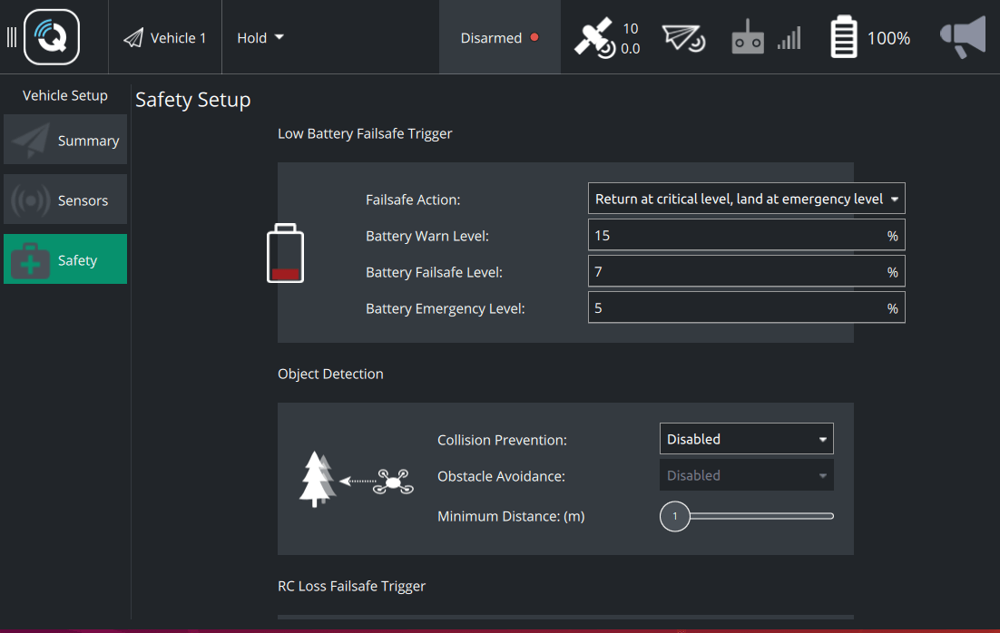

### Failsafe Actions

Failsafe detection can trigger one of the following (selectable)
actions.

Action | Description
--- | ------
None/ Disabled | No action (the failsafe will be ignored).
Warning | A warning message will be displayed/announced.
Hold mode | The vehicle will enter Hold mode. For multicopters this means the vehicle will hover, while for fixed/wing the vehicle will circle.
Return mode | The vehicle will enter [Return mode](#return-mode). Return behaviour can be set in the Return Home Settings (below).
Land mode | The vehicle will enter [Land mode](#land-mode), and land immediately.
CASA Outback Challenge rules | Unsupported. Do not use.
Flight termination | Turns off all controllers and sets all PWM outputs to their failsafe values. The failsafe outputs can be used to deploy a parachute, landing gear or perform another operation.
Lockdown | Kills the motors (sets them to disarmed). This is the same as using the kill switch.

> **Note:** It is possible to recover from a failsafe action (if the cause is fixed) by switching modes.
> For example, in the case where RC Loss failsafe causes the vehicle to enter Return mode, if RC is recovered you can change to Position mode and continue flying.

> **Note:** If a failsafe occurs while the vehicle is responding to another failsafe (e.g. Low battery while in Return mode due to RC Loss), the specified failsafe action for the second trigger is ignored.
> Instead the action is determined by separate system level and vehicle specific code.
> This might result in the vehicle being changed to a manual mode so the user can directly manage recovery.

### Low Battery

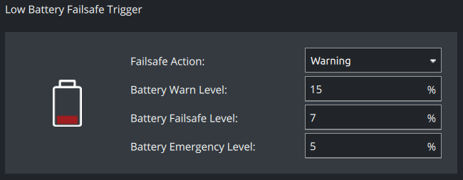

The *low battery failsafe* is triggered when the battery capacity drops below one (or more warning) level values.

The most common configuration is to set the action at *Return at critical level, land at emergency level* and the levels with Warn \> Failsafe \> Emergency.
With this configuration the failsafe will trigger warning, then return, and finally landing as the capacity drops below the respective levels.

Alternatively set the *Failsafe Action* to warn, return, or land when the **Battery Failsafe Level** level is reached.

<table>
<colgroup>
<col style="width: 50%" />
<col style="width: 50%" />
</colgroup>
<tbody>
<tr class="odd">
<td>
Setting
</td>
<td>
Description
</td>
</tr>
<tr class="even">
<td>
Failsafe Action
</td>
<td>
Values are:

<ul>
<li><em>Warning</em>. Warn (notification only) if capacity drops below Battery Failsafe Level.</li>
<li><em>Return Mode</em>. Return mode and warn if capacity drops below Battery Failsafe Level.</li>
<li><em>Land Mode</em>. Land mode and warn if capacity drops below Battery Failsafe Level.</li>
<li><em>Return at critical level, land at emergency level</em>. Triggers warning, return mode and land mode at the respective levels.</li>
</ul></td>
</tr>
<tr class="odd">
<td>
Battery Warn Level
</td>
<td>
Percentage capacity for Warnings (if Warning action enabled).
</td>
</tr>
<tr class="even">
<td>
Battery Failsafe Level
</td>
<td>
Percentage capacity for Return action (if enabled).
</td>
</tr>
<tr class="odd">
<td>
Battery Emergency Level
</td>
<td>
Percentage capacity for Land action (if enabled).
</td>
</tr>
</tbody>
</table>

### Object Detection

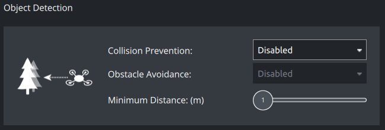

Enable/disable collision prevention and obstacle avoidance, and set the closest allowed approach distance when collision prevention is active.

Setting | Description
--- | ------
Collision Prevention | Disabled/Enabled.
Obstacle Avoidance   | Disabled/Enabled.
Minimum Distance     | Distance (metres) away from obstacle that vehicle will stop when collision prevention is active.

### RC Loss

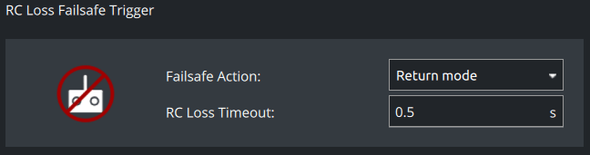

Set the action on RC loss, and how quickly the vehicle responds.

Setting | Description
--- | ------
Failsafe Action | Values are: *Disabled*, Hold mode, Return mode, Land mode, Data Link Auto Recovery (CASA Outback Challenge rules), Terminate, Lockdown.
RC Loss Timeout | Time after RC loss that the *Failsafe Action* is triggered.

### Data Link Loss

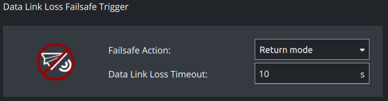

Set the action on data-link loss (loss of telemetry to ground station),
and how quickly the vehicle responds.

Setting | Description
--- | ------
Failsafe Action | Values are: *Disabled*, *Hold mode*, *Return mode*, *Land mode*, *Data Link Auto Recovery (CASA Outback Challenge rules)*, *Terminate*, *Lockdown*.
Data Link Loss Timeout | Time after data link loss that the *Failsafe Action* is triggered.

### Geofence Failsafe

The *Geofence Failsafe* is a "virtual" cylinder centered around the home position.
If the vehicle moves outside the radius or above the altitude the specified *Failsafe Action* will trigger.

> **Note:** QGC supports more complicated GeoFence geometries with multiple arbitrary polygonal and circular inclusion and exclusion areas in [Plan View \> Geofence](#geofence).

Set the action on fence breach, and the radius and/or altitude of the geofence cylinder.

Setting | Description
--- | ------
Action on Breach | Values are: none, *Warning*, *Hold mod*e, *Return mode*, *Terminate* (flight termination).
Max Radius       | Horizontal radius of geofence cylinder. Horizontal geofence disabled if 0.
Max Altitude     | Height of geofence cylinder. Altitude geofence disabled if 0.

### Return Mode Settings

> **Note:** Generally this setting should be pre-configured by the supplier of the vehicle.
> It is possible for the vehicle to be configured such that return behaviour will not be affected by these settings.

[Return mode](#return-mode) causes a vehicle to fly at a safe height to a safe destination, where it may loiter and/or then land.
This section allows the return height, and landing behaviour to be specified for rally point and home location landings.

Setting | Description
--- | ------
Climb to altitude of | Vehicle ascend to this minimum height (if below it) for the return flight.
Return home then     | The action on return: Land, Loiter and do not land, or Loiter and land after a specified time.
Loiter Time          | The time to loiter before landing (if return home action is *Loiter and land after a specified time*).
Loiter Altitude      | Altitude at which the vehicle will loiter (i.e. before landing).

### Land Mode Settings

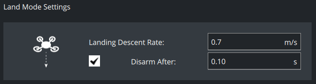

Specify Land mode descent and disarm behaviour.

Setting | Description
--- | ------
Landing Descent Rate | Land descent rate.
Disarm After | Auto disarm vehicle on landing (the default) by enabling the checkbox and setting the disarm time. If checkbox not enabled, the vehicle will not disarm after landing.

### Kill Switch / Gimbal Lock

The RC controller may have a *kill switch* configured to enable the *Flight Termination* safety failsafe.
When enabled this action turns off all controllers and sets all PWM outputs to their failsafe values.

The failsafe values may be used to deploy a parachute, landing gear or perform another operation.
For example, the screenshots below show a camera first in its normal position (forward facing), and then in locked in its safety position (pointing upwards).

> **Note:** Kill switch/failsafe behaviour depends on the connected hardware and PX4 configuration (i.e. it is controlled outside of QGC).
> For more information see:  <https://docs.px4.io/master/en/advanced_config/flight_termination.html>.

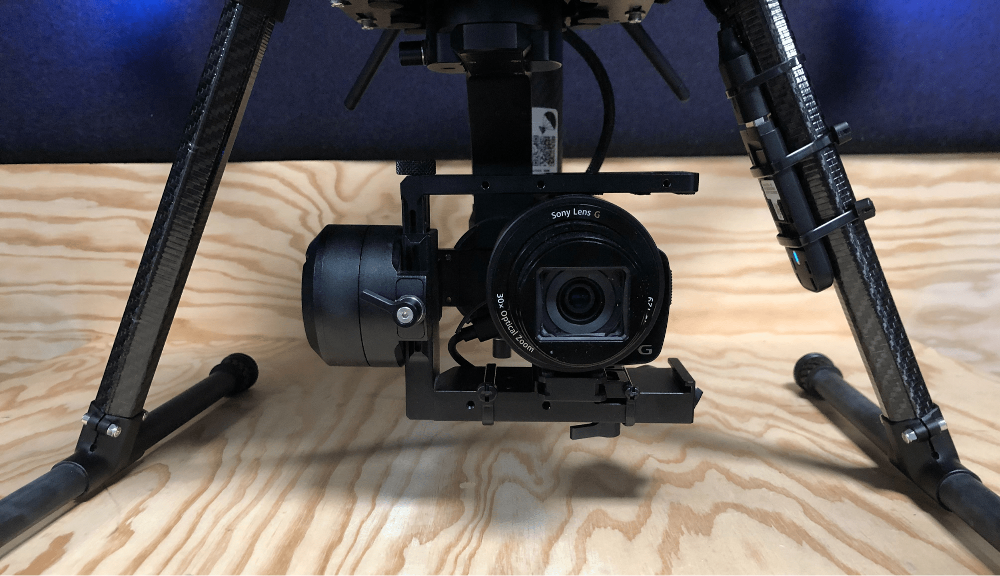

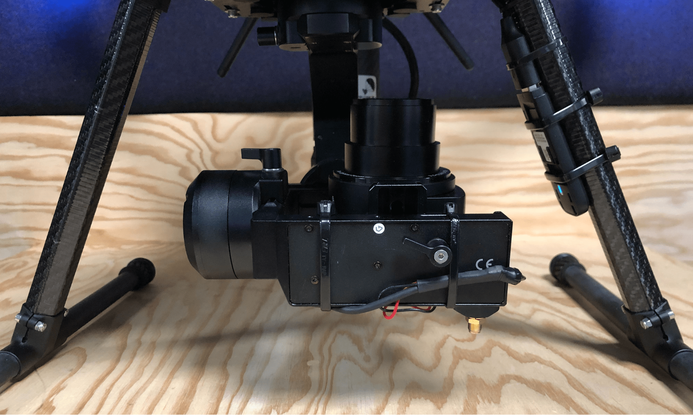

### Vehicle Telemetry Logging

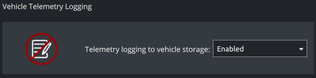

Enable telemetry logging to vehicle storage.

Setting | Description
--- | ------
Telemetry logging to vehicle storage | Enabled/Disable logging.

### Hardware In The Loop Simulation (HITL)

> **Note:** Pilots should not change this setting.

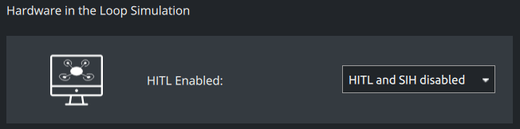

Enable hardware-dependent simulation: *hardware in the loop* or *simulation in hardware*.

<table>
<colgroup>
<col style="width: 50%" />
<col style="width: 50%" />
</colgroup>
<tbody>
<tr class="odd">
<td>
Setting
</td>
<td>
Description
</td>
</tr>
<tr class="even">
<td>
HITL Enabled
</td>
<td>
Values:

<ul>
<li>HITL and SIH disabled: Hardware-dependent simulation disabled.</li>
<li><em>HITL enabled</em>: Hardware-in-the-Loop simulation enabled.</li>
<li><em>SIH enabled</em>: Simulation in Hardware enabled.</li>
</ul></td>
</tr>
</tbody>
</table>

## Joystick Setup

Joystick setup is used to setup and calibrate the stick configuration and to assign actions to joystick buttons.

<!-- 
The RC stick control mode (mode 0, mode 1, mode 2 etc.) and the mapping of buttons to actions can be configured in the **Vehicle Settings > [Joystick Setup](#joystick-setup)** view.
-->

### General tab

The general tab is used to enable and verify joystick input.

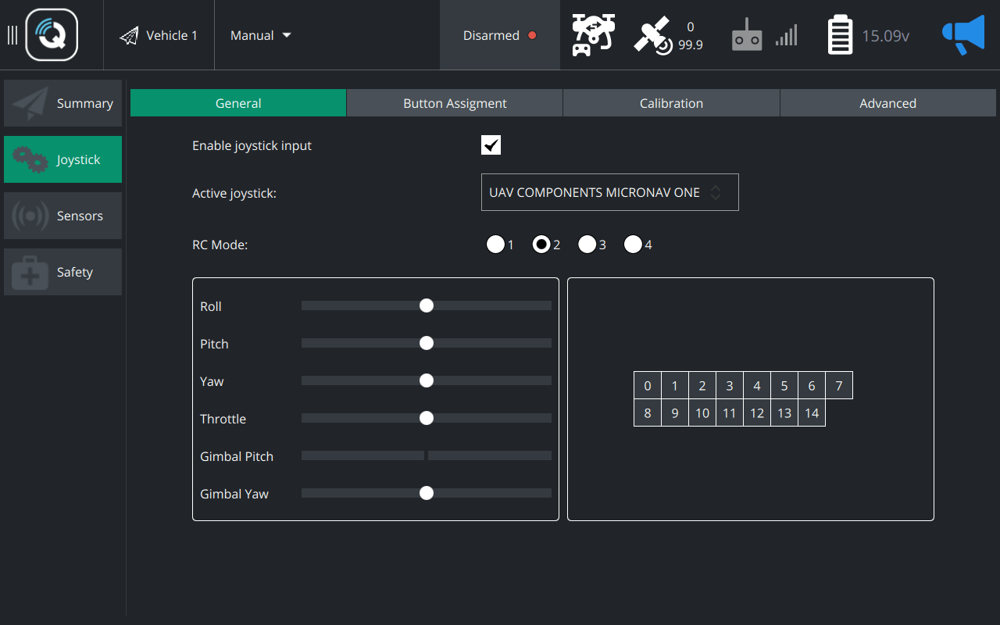

The settings are explained below.

Setting | Description
--- | ------
**Enable joystick input** | Select to start sending joystick commands to the connected vehicle.
Active joystick           | Ensure this matches the connected/desired joystick.
RC Mode                   | Set mode (see below) to define the function of the left and right sticks. This is normally set to 2 for US pilots.
Test Sticks               | Move the main and gimbal sticks and verify that the motion is as expected on the screen.
Test Buttons              | Press joystick buttons and verify that the expected buttons are highlighted on the screen.

RC Modes

RC Modes define how the movement of the left and right joysticks are mapped to throttle, pitch, yaw and roll.
The modes are largely a matter of preference: US pilots commonly use mode 2.

Mode | Left Stick (Forward/Back, Left/Right) | Right Stick (FB/LR)
--- | ----- | -----
1 | Pitch (FB), Yaw (LR)     | Throttle (FB), Roll (LR)
2 | Throttle (FB), Yaw (LR)  | Pitch (FB), Roll (LR)
3 | Pitch (FB), Roll (LR)    | Throttle (FB), Yaw (LR)
4 | Throttle  (FB), Roll(LR) | Pitch (FB), Yaw (LR)

### Button Assignment tab

The *Button Assignment* tab is used to assign functions to buttons (single-, long- and double-press) and to combinations of button presses.

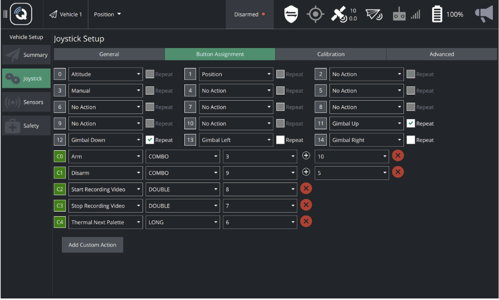

The (grey) numbered boxes at the top are used to assign actions  (e.g. a flight mode, trigger camera, etc.) corresponding to a single-click of each joystick button.
Some actions correspond to operations that should be repeated if the button is held down (e.g. incrementing the camera zoom in steps).
Select the **Repeat** checkbox if the button is to be used in this way (this can only be set for actions where repeating may be appropriate).

The **Add Custom Action** button allows you to define that an action occurs on a button long press, double press, or combination of two other buttons being pressed together:

> **Note:** A button can be assigned a single-press and at most one other operation (e.g. a long press or a double press).
> Some operations are invalid (e.g. long press and repeat).
>
> It is possible to define a custom action that makes another button action invalid.
>Check that all button colors are green to confirm they are valid (red indicates an invalid assignment).

1. Press the button to create a *custom action i*tem.

   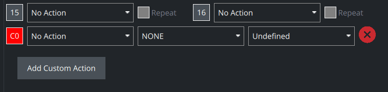

   The item will initially be shown with a red label to indicate that the assignment is incomplete or invalid.
2. Choose the associated action/function using the selector.
3. Choose the custom action type: COMBO, DOUBLE, LONG, NONE (for multiple button press, double-press, long-press, and nothing respectively).
4. Use the drop down to select the button for which the operation applies.
5. For COMBO actions then select the second button.
      
   A valid and complete action is highlighted by a green label.
   Custom actions can be removed by selecting the red X marker at the end of the item.
   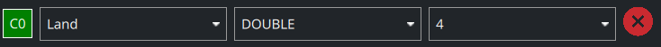

The main button settings are listed below:

<table>
<colgroup>
<col style="width: 50%" />
<col style="width: 50%" />
</colgroup>
<tbody>
<tr class="odd">
<td>
Setting
</td>
<td>
Description
</td>
</tr>
<tr class="even">
<td>
<strong>Action Selector</strong>
</td>
<td>
Select the box then choose an action from the popup, including:<strong> 
</strong><em>No Action, Acro, Attitude, Arm, Continuous Zoom In, Continuous Zoom Out, Disarm, Follow Me, Gimbal Center, Gimbal Down, Gimbal Left, Gimbal Pitching Down, Gimbal Pitching Up, Gimbal Right, Gimbal Up, Hold, Land, Manual, Mission, Next Camera, Next Video Stream, Offboard, Position, Precision Land, Previous Camera, Previous Video Stream, Rattitude, Ready, Return, Return to Groundstation, Simple, Stabilized, Start Recording Video, Step Zoom in, Step Zoom out, Stop Recording Video, Takeoff, Thermal Next Palette, Thermal OFF, Thermal ON, Thermal ON/OFF, Toggle Arm, Toggle Recording Video, Trigger Camera,
VTOL: Fixed Wing, VTOL: Multi-Rotor</em>.
</td>
</tr>
<tr class="odd">
<td>
Repeat checkbox
</td>
<td>
Check for actions that should be repeated if the button is held
down (e.g. incrementing the camera zoom in steps). This can only be
selected for actions where repeating is appropriate.
</td>
</tr>
<tr class="even">
<td>
Button-Press Type
</td>
<td>
COMBO, DOUBLE, LONG, NONE
</td>
</tr>
</tbody>
</table>

### Calibration tab

The *Calibration* tab is used to calibrate the joystick sticks.

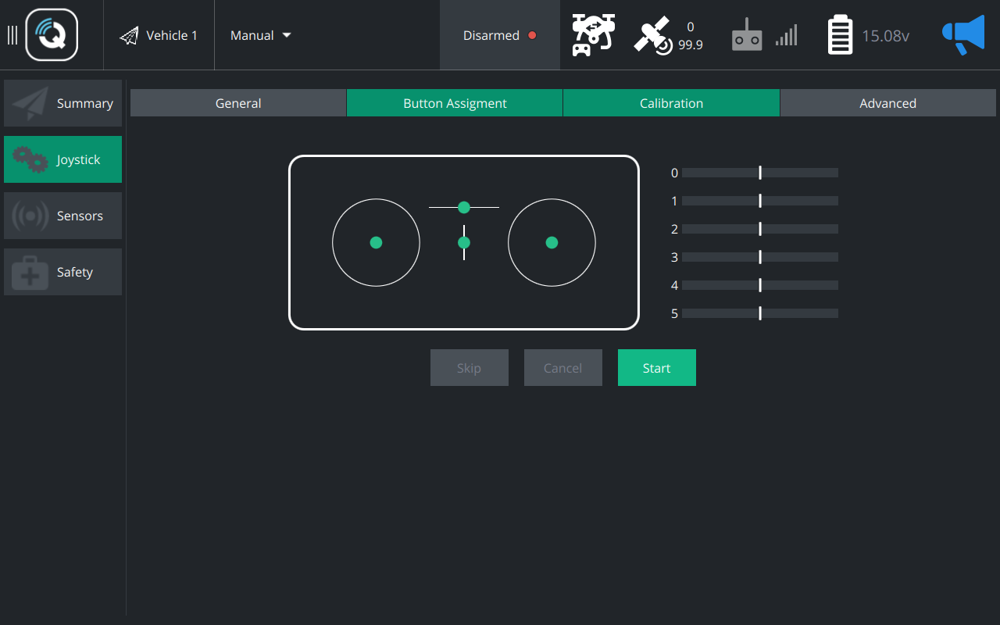

The process is guided: just click the **Start** button and follow the on-screen instructions.

### Advanced tab

The *Advanced* tab sets the advanced behaviour of the joystick controls.

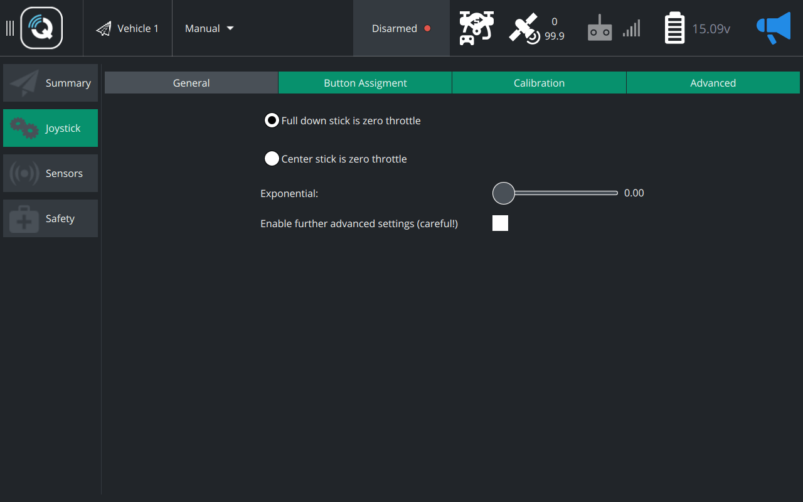

The controls are:

<table>
<colgroup>
<col style="width: 50%" />
<col style="width: 50%" />
</colgroup>
<tbody>
<tr class="odd">
<td>
Setting
</td>
<td>
Description
</td>
</tr>
<tr class="even">
<td>
<strong>Radio button</strong>
</td>
<td>
Full down stick is zero throttle | Center stick is zero
throttle.
</td>
</tr>
<tr class="odd">
<td>
Exponential
</td>
<td>
By default the response to stick movement is linear (exponential=0).
The exponential value makes the joystick less responsive in the middle of the range and more responsive on the edges - which can make it easier to fly. 
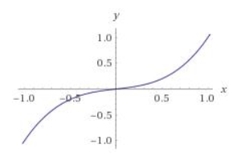
</td>
</tr>
<tr class="even">
<td>
Enable further advanced settings (careful):
</td>
<td>
Check to open up more options. Pilots should generally not touch these (and they are therefore not documented).
</td>
</tr>
</tbody>
</table>

# Application Settings

The *Application Settings* view is used to configure the settings that aren't specific to a particular vehicle: e.g. display language and units, comms links, console output.

> **Note:** Pilots should generally not need to use the _Application Settings_, as QGC should be supplied on pre-configured hardware.
> Only a few select settings are covered by this guide.

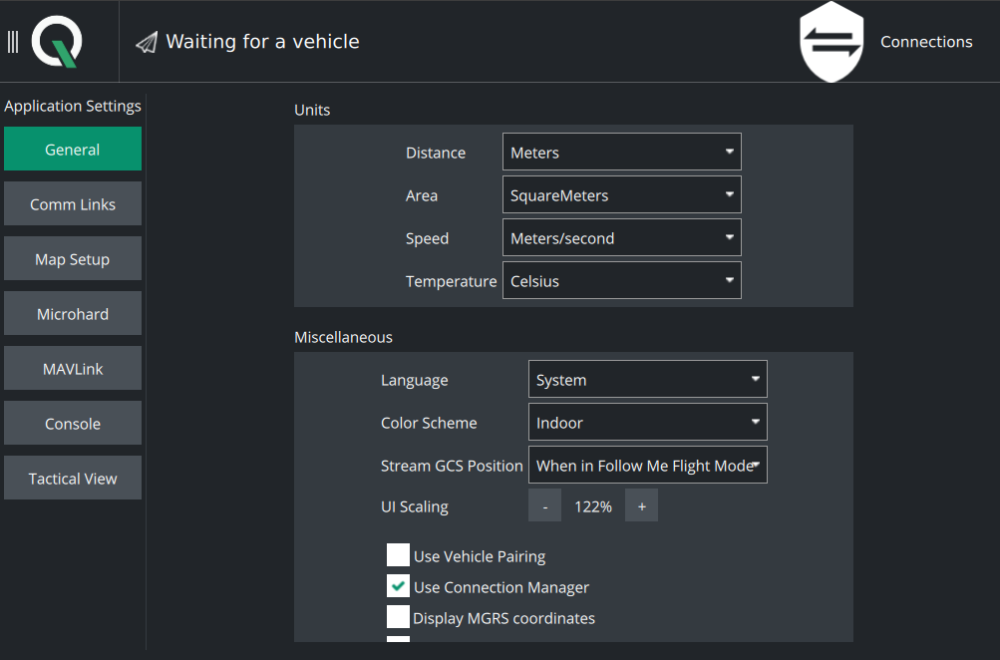

## General

### Miscellaneous

- 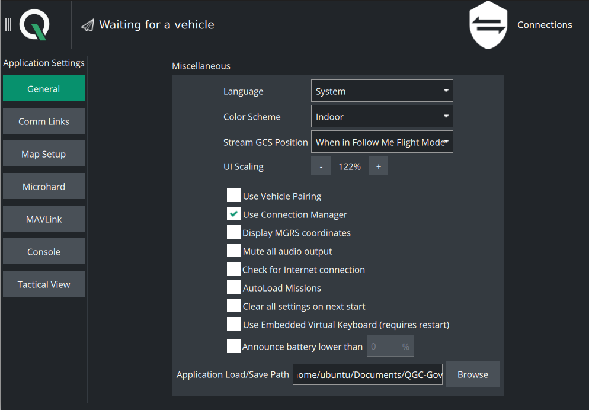

Setting | Description
--- | ------
Use Connection Manager   | Check to enable the [Connection Manager](#connection-management).
Disable MGRS coordinates | Uncheck to overlay an [MGRS grid](#map-grid-mgrs) on the map in Plan and Fly views.

## Microhard

The microhard app settings are deprecated and will be removed (they are not used if **Use Connection Manager** is enabled).
